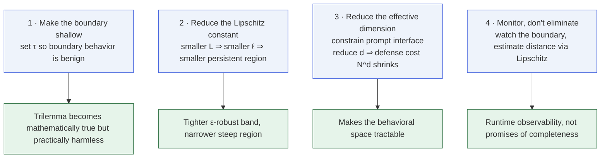
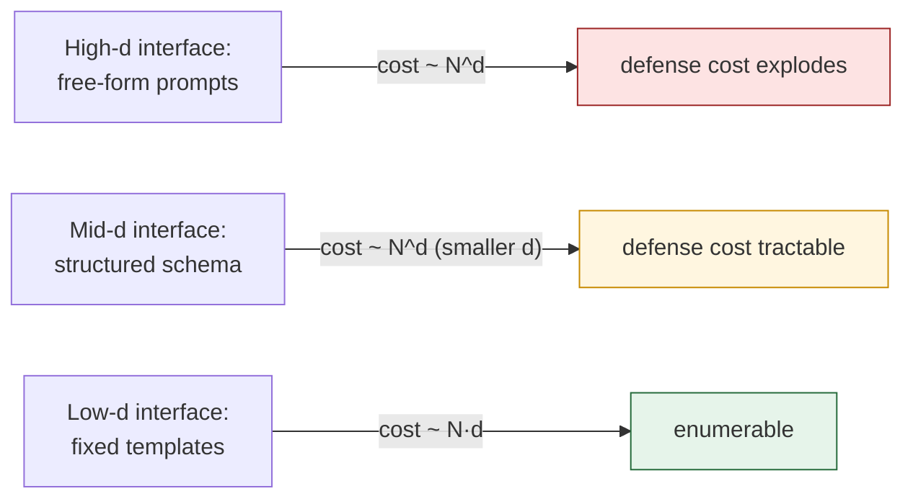

# The Engineering Prescription

The theorems do not say defense is useless; they say **complete**
defense is impossible under the stated constraints. The engineering
goal therefore shifts from *elimination* to *management*, and the
paper's four-point prescription falls out naturally from the tier
structure.

## The four-point plan

## 1 · Make the boundary shallow

Set $\tau$ so that boundary-level behavior $f(z)=\tau$ yields a polite
refusal rather than harmful compliance. If the worst thing that can
happen at $f=\tau$ is mildly unhelpful, the impossibility is
mathematically true but operationally uninteresting.

::: remark
The paper's GPT-5-Mini experiment exemplifies this: its ceiling at
$\mathrm{AD}=0.50$ means $U_\tau=\emptyset$ in the observed range, so
the impossibility theorems **do not apply** to it and no defense
failure is predicted. The same can be engineered by choosing $\tau$
below the maximum observed alignment deviation of the base model.
:::

## 2 · Reduce the Lipschitz constant

Smaller $L$ tightens the bound $\ell\le L$ and therefore:

- narrows the T2 ε-robust band (width $\propto LK$);
- shrinks the T3 steep region (needs $G>\ell(K+1)$).

The trade-off: **smoother surfaces spread vulnerabilities over wider
but more easily monitored regions**. Rough surfaces create tiny
isolated pockets; smooth surfaces create large gentle slopes.

## 3 · Reduce the effective dimension

Defense cost grows as $N^d$ where $d$ is the effective dimension of
the prompt interface. Constraining the interface — standardized
formats, restricted API parameters, bounded context lengths —
reduces $d$ and makes the behavioral space tractable. This is the
**only** lever in the prescription that attacks the cost asymmetry
directly.

## 4 · Monitor, don't eliminate, the boundary

The boundary does not go away — tier T1 says so. But the Lipschitz
bound of tier T2 turns this into an actionable **observability**
signal: from any observed value $f(x)$ you can estimate the distance
to the boundary as at least $|f(x)-\tau|/L$.

Build runtime monitoring that:

- tracks the observed $f$ values of live traffic;
- alerts when $f$ approaches $\tau$ along any direction with high
  directional slope;
- combines with standard incident-response processes.

This does not make the trilemma false — it just turns it from an
"elimination" problem into an "ongoing management" problem, which the
rest of security engineering already knows how to handle.

## What the prescription does **not** promise

- It does **not** promise that the defense becomes complete. Tier T1
  still fires; some boundary points will always be fixed.
- It does **not** promise that the band or steep region become empty.
  Lower $L$ and higher $K$ shrink them, but not to zero.
- It does **not** escape the trilemma. It just moves the failure mode
  into territory where it's cheap to manage.

## Cross-references

- [The Defense Trilemma](/trilemma) — the structural constraint.
- [T3 · Persistent Unsafe Region](/theorems/persistent) — what
  "reducing $L$" concretely buys you.
- [Pipeline Degradation](/theorems/pipeline) — why agent tool chains
  fight the prescription.
- [Limitations & counter-examples](/limitations) — the exact scope of
  the theorems.
