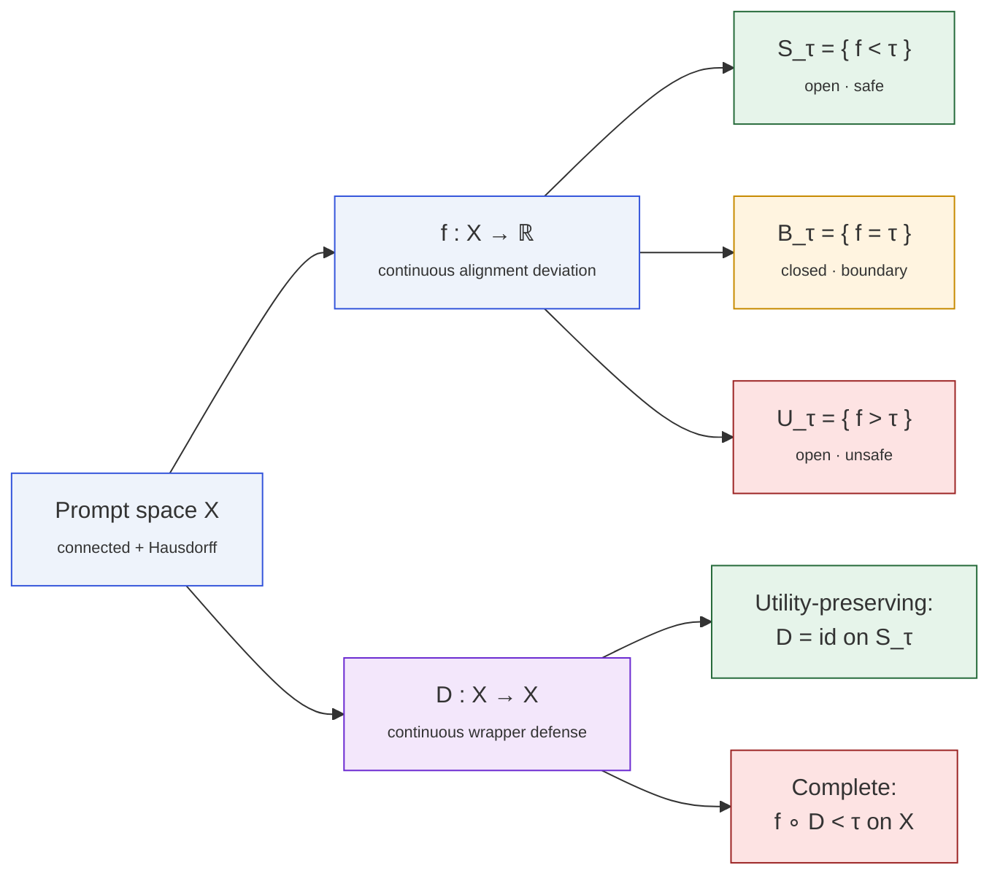

# Formal Framework

The impossibility theorems live inside a very small amount of structure.
Everything follows from three ingredients: a space of prompts, a
continuous alignment score, and a continuous defense wrapper.

## The three objects

::: definition
**Prompt space.** A topological space $X$. For the main theorems we assume
$X$ is **connected** and **Hausdorff** (T2). A Lipschitz metric structure
is added only for tiers T2 and T3.
:::

::: definition
**Alignment deviation.** A continuous function $f\colon X\to\mathbb{R}$
measuring how far the model's behavior on an input deviates from the
desired alignment policy. Fix a threshold $\tau\in\mathbb{R}$ and write:

$$
S_\tau \;=\; \{x : f(x) < \tau\} \quad\text{(safe)}, \qquad
U_\tau \;=\; \{x : f(x) > \tau\} \quad\text{(unsafe)}, \qquad
B_\tau \;=\; \{x : f(x) = \tau\} \quad\text{(boundary)}.
$$

Because $f$ is continuous, $S_\tau$ and $U_\tau$ are **open**, and $B_\tau$
is **closed**.
:::

::: definition
**Defense wrapper.** A continuous map $D\colon X\to X$. We call $D$
**utility-preserving** if $D(x)=x$ for every $x\in S_\tau$, and
**complete** if $f(D(x))<\tau$ for every $x\in X$.
:::

## The objects at a glance

## Regularity upgrades

| Tier | Extra hypothesis on $X$, $f$, $D$ | Conclusion the tier adds |
|---|---|---|
| **T1 · Boundary Fixation** | none beyond connected + Hausdorff | $\exists z\ f(z)=\tau,\ D(z)=z$ |
| **T2 · ε-Robust**          | $(X,d)$ metric; $f$ $L$-Lipschitz; $D$ $K$-Lipschitz | $f(D(x))\ge \tau - LK\,d(x,z)$ |
| **T3 · Persistent**        | transversality $G>\ell(K+1)$ at $z$ | positive-measure set with $f(D(x))>\tau$ |

The steepness constant $\ell$ is the **defense-path Lipschitz constant**,
$$
\ell \;=\; \sup_{x\ne D(x)}\ \frac{|f(D(x))-f(x)|}{d(D(x),x)},
$$
measuring $f$'s growth rate in the direction the defense actually moves
points. It always satisfies $\ell\le L$; anisotropic landscapes have
$\ell\ll L$, which is exactly the regime where tier T3 bites.

## Why "continuous" is the right abstraction

Continuity is the mathematical formalization of a very mild requirement:
_two prompts that are almost identical receive almost the same treatment
from the defense._ Any production system with:

* a tokenizer that varies continuously on edits of the input,
* a learned classifier outputting a continuous logit,
* an embedding-based rewrite,

is effectively continuous on the relevant subspace. The paper's
**Tietze extension** bridge (see [here](/proofs/discrete-to-continuous))
shows that even finitely many token-level observations _force_ such a
continuous extension to exist — the impossibility applies to every model
consistent with the data.

## What this framework does **not** cover

The wrapper model $D\colon X\to X$ is strictly less general than the full
space of defense mechanisms. The theorems **do not** constrain:

- training-time alignment (RLHF, DPO, constitutional AI),
- architectural changes to the model,
- output-side filters (the wrapper acts on inputs),
- discontinuous defenses (hard blocklists, deterministic classifiers),
- ensemble or human-in-the-loop review,
- systems with rejection/abort actions instead of an input-to-input map.

See [Limitations](/limitations) for the corresponding counter-examples.
