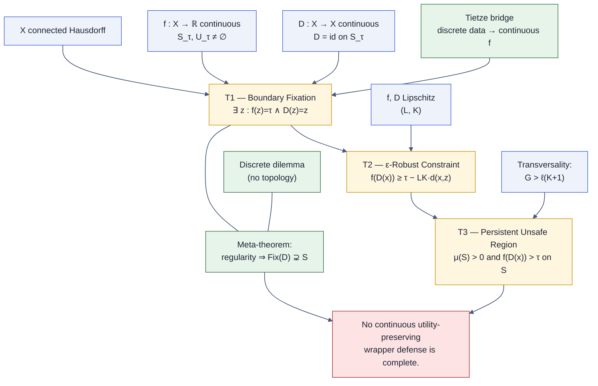

## The one-paragraph argument

Let $X$ be a connected Hausdorff space of prompts and let $f\colon X\to\mathbb{R}$
be a continuous alignment-deviation score with threshold $\tau$. A
**wrapper defense** is a continuous map $D\colon X\to X$ that leaves every
safe prompt unchanged. Because $D$ is continuous and safe inputs are fixed,
the fixed-point set $\mathrm{Fix}(D)$ is a **closed** set containing the
**open** safe region $S_\tau = \{f<\tau\}$. In a connected space an open set
cannot simultaneously be closed unless it is all of $X$, so the closure of
$S_\tau$ must contain new points — points where $f(z)=\tau$ exactly.
Every such $z$ is fixed by $D$, so $D$ passes them through unchanged with
no remediation. The three successively stronger theorems
([T1](/theorems/boundary-fixation), [T2](/theorems/eps-robust),
[T3](/theorems/persistent)) upgrade this single fixed point first to a
Lipschitz-constrained neighborhood and finally, under transversality, to a
positive-measure region that remains strictly above $\tau$ after defense.

## End-to-end logical picture

## Where to go next

| If you want to… | Start at |
|---|---|
| See the three tiers side-by-side | [Theorem index](/theorems/) |
| Follow the five-step geometric proof | [Boundary five-step proof](/proofs/boundary-five-step) |
| Understand the trilemma picture | [The Defense Trilemma](/trilemma) |
| See how discrete data connects to the continuous theorems | [Discrete → continuous](/proofs/discrete-to-continuous) |
| Understand why pipelines make it *worse* | [Pipeline Degradation](/theorems/pipeline) |
| Inspect the Lean 4 proof structure | [Lean artifact](/lean-artifact) |
| Know what the theorem does *not* say | [Limitations](/limitations) |
