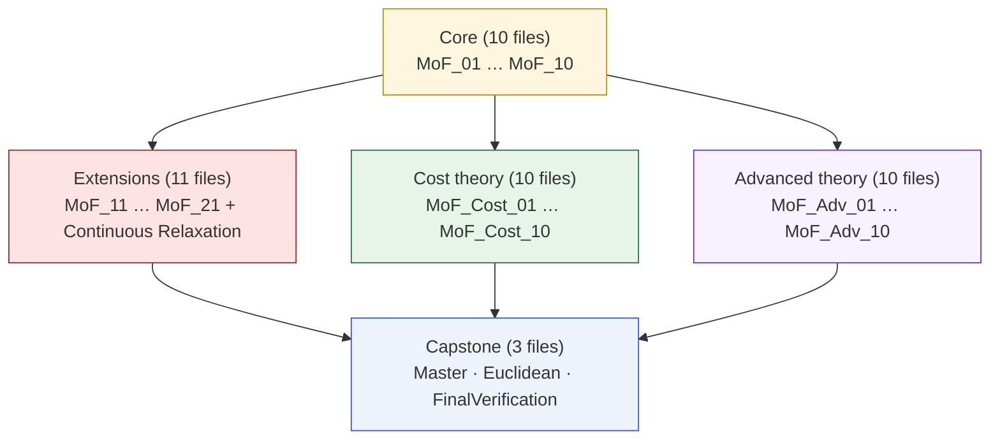

# Lean 4 Artifact

The theorems on this site are **machine-verified** in Lean 4 against
Mathlib. This page is the guided tour of the artifact — what's in it,
how to re-run it, and where to look first.

## Quick facts

| | |
|---|---|
| Lean toolchain | 4.28.0 |
| Mathlib | v4.28.0 |
| Files | 46 |
| Theorems | ≈ 360 |
| `sorry` statements | 0 |
| Custom axioms | 0 |
| Standard axioms used | `propext`, `Classical.choice`, `Quot.sound` |
| Build | `lake build` succeeds, zero errors |

## High-level shape



## Building the artifact

```bash
cd ManifoldProofs
lake build
```

This imports all 46 files from `ManifoldProofs.lean` and succeeds
with zero errors on any Lean 4.28.0 + Mathlib v4.28.0 install.

## Key files (the 20% you want to read first)

| File | What it proves |
|---|---|
| `MoF_08_DefenseBarriers` | **T1 · Boundary Fixation** (the five-step proof) |
| `MoF_11_EpsilonRobust` | **T2 + T3** ε-robust band and persistent region |
| `MoF_12_Discrete` | Discrete IVT, non-injectivity dilemma, capacity pigeonhole |
| `MoF_13_MultiTurn` | Multi-turn + stochastic + capacity parity |
| `MoF_14_MetaTheorem` | Regularity ⇒ spillover (representation-independent) |
| `MoF_15_NonlinearAgents` | Pipeline Lipschitz degradation $K^n$ |
| `MoF_16_RelaxedUtility` | Score-preserving + ε-approximate variants |
| `MoF_17_CoareaBound` | Ball-based coarea volume bound for the band |
| `MoF_18_ConeBound` | Cone lower bound for the persistent region |
| `MoF_19_OptimalDefense` | Defense dilemma / $K^\star=G/\ell - 1$ |
| `MoF_21_GradientChain` | `HasFDerivAt` ⇒ steep region non-empty |
| `MoF_ContinuousRelaxation` | Tietze bridge: discrete data → continuous $f$ |
| `MoF_MasterTheorem` | Unified packaged version of the result |
| `MoF_Instantiation_Euclidean` | Instantiation to $\mathbb{R}^n$ |
| `MoF_FinalVerification` | Axiom audit against the standard three |

## The five-step proof in Lean

Here is the actual Lean signature of the T1 capstone in
`MoF_08_DefenseBarriers`, exactly as it appears in the artifact:

```lean
-- In a T2 space, the fixed-point set of a continuous map is closed.
theorem defense_fixes_closure
    {X : Type*} [TopologicalSpace X] [T2Space X]
    {D : X → X} (hD : Continuous D) :
    IsClosed {x : X | D x = x}

-- Safe inputs are fixed by the defense.
theorem safe_subset_fixedPoints
    {X : Type*} {D : X → X} {f : X → ℝ} {τ : ℝ}
    (h_safe : ∀ x, f x < τ → D x = x) :
    {x : X | f x < τ} ⊆ {x : X | D x = x}

-- Closure of the safe region is fixed.
theorem closure_safe_subset_fixedPoints
    {X : Type*} [TopologicalSpace X] [T2Space X]
    {D : X → X} {f : X → ℝ} {τ : ℝ}
    (hD : Continuous D)
    (h_safe : ∀ x, f x < τ → D x = x) :
    closure {x : X | f x < τ} ⊆ {x : X | D x = x}

-- Boundary fixation capstone.
theorem defense_incompleteness
    {X : Type*} [TopologicalSpace X] [T2Space X] [ConnectedSpace X]
    {f : X → ℝ} {D : X → X} {τ : ℝ}
    (hf : Continuous f) (hD : Continuous D)
    (h_safe : ∀ x, f x < τ → D x = x)
    (h_ne_safe : ∃ x, f x < τ)
    (h_ne_unsafe : ∃ x, τ < f x) :
    ∃ z, f z = τ ∧ D z = z
```

Every theorem here is `#check`ed against the `lake build` exit code,
and `MoF_FinalVerification` re-computes the transitive axiom
dependencies of the final packaged result to ensure the **only**
axioms used are `propext`, `Classical.choice`, and `Quot.sound`.

## Dependency details

See the [Lean dependency graph](/proofs/lean-dependency-graph) for a
file-level view of which modules import which.

## Source

The full artifact is in the `ManifoldProofs/` folder of the
[paper repository](https://github.com/mbhatt1/stuff).
