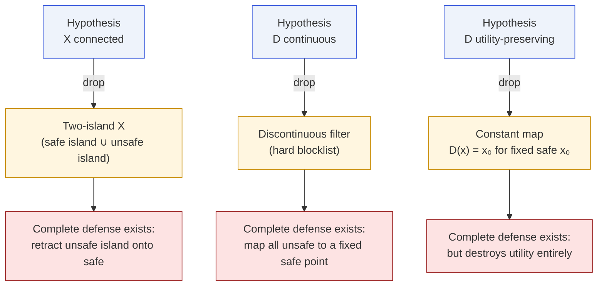

# Limitations & Counter-examples

The theorems are carefully scoped. This page lists the hypotheses that
are genuinely necessary — dropping any one of them admits a
counter-example — and spells out what the impossibility **does not
cover**.

## The three necessary hypotheses

Tier T1 needs all of:

1. **$X$ connected.** Without connectedness, a safe island and an
   unsafe island can be retracted onto each other discontinuously.
2. **$D$ continuous.** Without continuity, hard blocklists / discrete
   classifiers escape the theorem entirely.
3. **$D$ utility-preserving on $S_\tau$.** Without any form of
   identity-on-safe, a constant map $D(x)=x_0$ can be both continuous
   and complete.

The appendix of the paper gives explicit counter-examples for each.

## What the theorems do **not** cover

The paper is careful to spell out the scope. The theorems **do not**
preclude effective safety through:

- **Training-time alignment.** RLHF, DPO, constitutional AI training
  act on the model itself, not as a wrapper $D\colon X\to X$.
- **Architectural changes.** Modifying the model's internal
  representation or attention pattern is not a wrapper.
- **Discontinuous defenses.** Hard blocklists, keyword filters,
  discrete classifiers can be complete; they are simply not covered
  by the continuity-based argument.
- **Output-side filters.** Our $D$ acts on inputs. Output-side
  filtering is a different object (a map on the model's *codomain*).
- **Ensemble defenses or human-in-the-loop review.** Neither is a
  single continuous wrapper.
- **Adaptive-threshold systems.** If $\tau$ can change per input in a
  way that depends on the full prompt, the setup no longer fits the
  fixed-$\tau$ framework.
- **Multi-component systems with rejection.** Defenses that can abort
  or redirect instead of producing an output in $X$ are outside the
  framework.

```mermaid
flowchart TB
    classDef covered fill:#fde3e3,stroke:#9c2424;
    classDef uncovered fill:#e6f4ea,stroke:#256a3a;

    subgraph Covered["Covered by the impossibility"]
      direction TB
      C1["Continuous wrapper D : X → X"]:::covered
      C2["Lipschitz wrappers"]:::covered
      C3["Expected-score stochastic wrappers"]:::covered
      C4["Multi-turn wrappers"]:::covered
      C5["Lipschitz agent pipelines"]:::covered
    end

    subgraph NotCovered["Not covered"]
      direction TB
      N1["Training-time alignment"]:::uncovered
      N2["Architectural changes"]:::uncovered
      N3["Hard blocklists / discontinuous filters"]:::uncovered
      N4["Output-side filters"]:::uncovered
      N5["Ensembles, HITL review"]:::uncovered
      N6["Rejection / abort defenses"]:::uncovered
      N7["Adaptive thresholds"]:::uncovered
    end
```

## Three further caveats

1. **Boundary fixation is at the boundary.** The fixed points have
   $f(z)=\tau$ exactly. If $\tau$-level behavior is benign, the
   theorem is true but practically harmless — see
   [Engineering Prescription](/engineering).
2. **T2 limits depth, not direction.** Tier T2 bounds how far below
   $\tau$ the defense can push near-boundary points. It does not
   exclude a shallow reduction — it just caps the reduction by
   $LK\,d(x,z)$.
3. **T3 requires transversality.** The persistent unsafe region exists
   only when $G>\ell(K+1)$. On isotropic surfaces ($\ell=L$) the
   steep region is empty for every $K\ge 0$ and tier T3 is vacuous.
4. **Grid cost asymmetry is for grids.** The exponential defense-cost
   lower bound assumes grid enumeration. Learning-based defenses that
   generalize across the space may sidestep the $N^d$ bound for cost
   purposes, though they are still subject to T1.

## Summary

The theorems are **both** narrower and broader than they might look at
first glance:

- **Narrower**, because they only constrain a specific class of
  defenses — continuous input-to-input wrappers on a connected space.
- **Broader**, because within that class, the impossibility is
  remarkably insensitive to extra structure: adding Lipschitz bounds,
  randomization, memory, or tool-calls only makes the impossibility
  harder to escape, never easier.

If you want a defense that the theorems do not reach, drop out of the
continuous-wrapper class — but do not assume that by doing so you have
also escaped the **engineering** constraints the theorems identify
(cost asymmetry, capacity parity, boundary monitoring).
