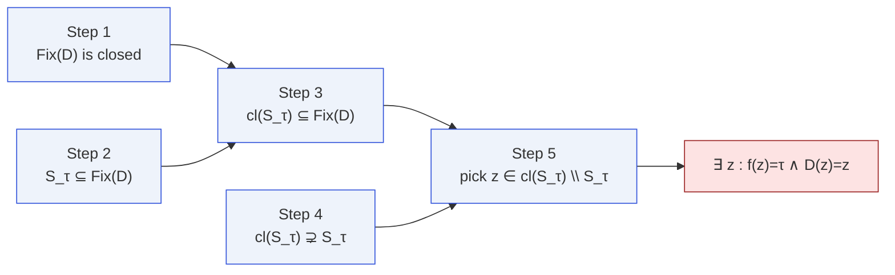
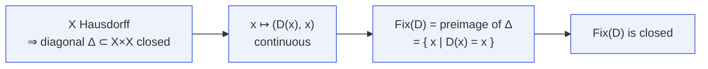
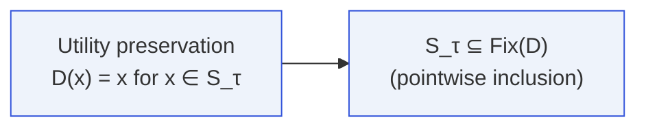
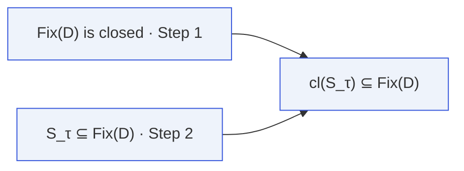
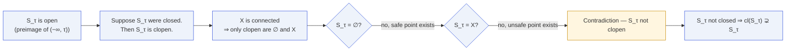
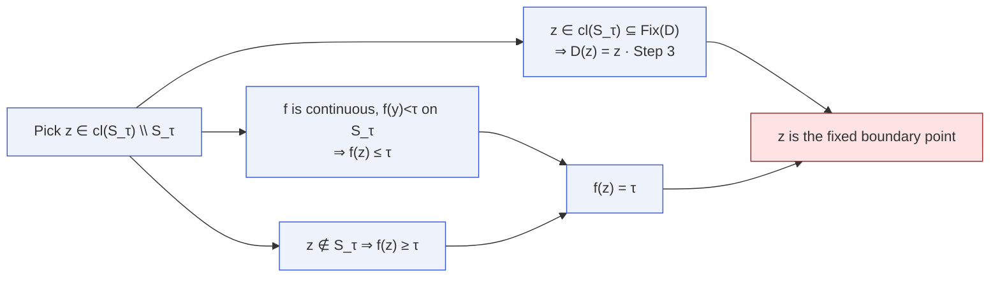

# The Five-Step Boundary Proof

A closer look at the proof of [T1 · Boundary
Fixation](/theorems/boundary-fixation). Each step is a single,
elementary fact; the power comes from composing them in the right
order.

## The shape of the argument

Steps 1–2 are the setup; step 3 is the direct consequence; step 4 is
the topological fact that makes the argument actually produce new
points; step 5 reads off the conclusion.

## Step 1 — Fix(D) is closed

In Lean: `defense_fixes_closure`.

::: details What "Hausdorff" is doing
Hausdorff-ness is exactly the statement that the diagonal is closed.
Without it, the set of fixed points might fail to be closed and the
entire argument collapses. This is why the T1 hypothesis includes T2
(Hausdorff), not merely continuity.
:::

## Step 2 — S_τ is inside Fix(D)

In Lean: `safe_subset_fixedPoints`. This step is a direct rewrite, not
a topological fact.

## Step 3 — cl(S_τ) is inside Fix(D)

A closed set that contains a subset $A$ also contains $\mathrm{cl}(A)$.
This is the key lemma: it transfers the identity relation from
the **open** safe region to its topological closure, which contains
genuine boundary points.

In Lean: `closure_safe_subset_fixedPoints`.

## Step 4 — cl(S_τ) strictly contains S_τ

This is the topological heart of the whole paper: **an open, proper,
non-empty subset of a connected space is not closed**. Without
connectedness the argument can be broken — the trivial counterexample
is two disjoint "islands", safe and unsafe, living in a disconnected
$X$ and the defense can retract one to the other discontinuously.

In Lean: `boundary_in_closure_of_safe`.

## Step 5 — Read off the conclusion

In Lean: `defense_preserves_boundary_value` and
`defense_incompleteness`.

## Why this proof is robust

The same five steps survive every generalization in the paper:

- **Score-preserving relaxation.** Replace "$D(x)=x$" with
  "$f(D(x))=f(x)$" and apply the steps to $h=f\circ D - f$.
- **ε-approximate relaxation.** Apply the steps to the closed super-level
  set $\{h\ge -\varepsilon\}$.
- **Stochastic defense.** Apply the steps to $g=\mathbb{E}[f\circ D]$.
- **Multi-turn.** Run the same five steps at every turn.
- **Pipeline.** Apply the steps to $f\circ P$ where $P$ is the composed
  pipeline.

Every case reuses _this_ five-step skeleton, which is why a single
fact — closure of $\mathrm{Fix}(D)$ together with connectedness — can
power the entire impossibility hierarchy.
