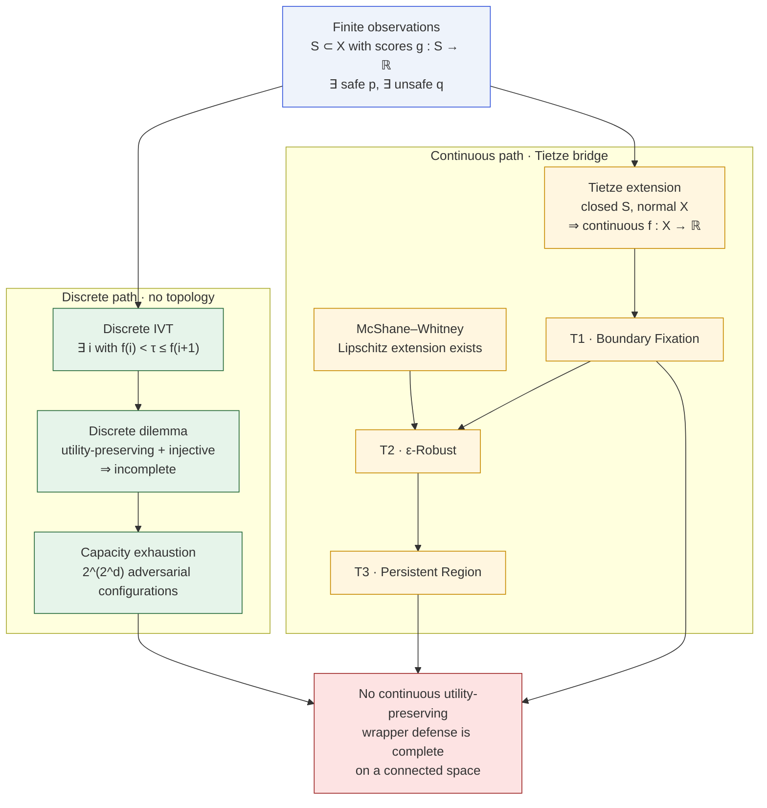
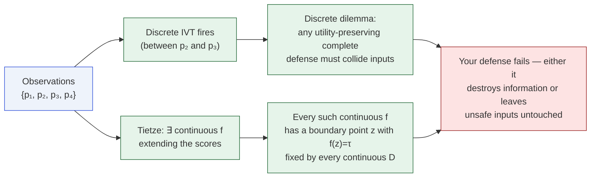

# From Discrete to Continuous

The paper closes off the obvious escape — "maybe the impossibility is a
continuous-mathematical artifact" — with **two complementary proofs**:

- a purely discrete proof that needs no topology, and
- a Tietze-based bridge showing that any continuous model consistent
  with finitely many observations inherits the continuous impossibility.

## Both paths, one conclusion

## Why two directions matter

| Question | Answer |
|---|---|
| "Maybe the continuous argument secretly assumes a structure real models don't have?" | No — the discrete dilemma fires on pure finite sets, no topology. |
| "Maybe the discrete dilemma is trivially true and doesn't tell us anything about real continuous models?" | No — Tietze promotes your finitely many observations into a continuous model that still fails. |
| "Maybe I can just pick a non-standard smoothing?" | No — Tietze's extensions are not unique, but **every** continuous extension inherits the impossibility. |

## A concrete scenario

Suppose you run a red-team and obtain a table of scored prompts:

| Prompt | Score |
|---|---|
| $p_1$ (safe) | 0.12 |
| $p_2$ (safe) | 0.30 |
| $p_3$ (unsafe) | 0.76 |
| $p_4$ (unsafe) | 0.95 |

Pick a threshold $\tau=0.50$. The observation set contains both safe
and unsafe points, so:

Both arguments reach the same conclusion on the same data. You cannot
escape by choosing a different interpolation scheme or refusing to
model the prompt space continuously.

## What's special about Tietze here

Tietze extension is a **black box**: all it needs is a closed subset
in a normal space. Our finite $S$ is closed (in any T1 space) and
$X$ being Hausdorff metric is automatically normal. No fancy machinery
is needed to go from the table above to an actual continuous model.
The McShane–Whitney variant additionally gives you a Lipschitz
extension, which is all you need to invoke T2 and T3.

## What's special about the discrete dilemma

The discrete dilemma uses only **counting** and **induction** — no
limits, no closures, no measure. It is fully formalized in
`MoF_12_Discrete` against Mathlib's `Finset` API and is completely
standalone: removing every other file in the artifact does not break
it.

## Consequences for empirical evaluation

- **Your benchmark is enough.** If any evaluation dataset contains at
  least one confirmed-safe and one confirmed-unsafe prompt, the
  impossibility applies to every continuous defense you could deploy
  on top of the model that produced those labels.
- **More data is worse, not better.** The larger your
  labeled unsafe set, the bigger the cone / steep region you know
  exists, and the more of it tier T3 covers.
- **Smoother models are not immune.** Smoothness (small $L$) only
  tightens the T2 neighborhood bound; the boundary fixation point
  still exists.

## Next

- [T1 · Boundary Fixation](/theorems/boundary-fixation)
- [Discrete Impossibility](/theorems/discrete)
- [Tietze bridge](/theorems/tietze)
- [Meta-theorem](/theorems/meta-theorem) — the unified version.
