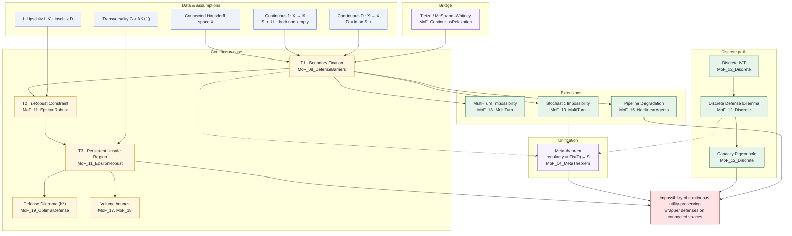

# End-to-end Proof Map

This is the "one picture" view of how every theorem in the paper feeds
into the final impossibility. Read it top-to-bottom; each box points at
the Lean module that formalizes it.

## The whole theory in one graph

Solid arrows are logical implications; dashed arrows are instantiations
of the meta-theorem.

## How to read the Lean artifact against this map

| Lean module | Role in the proof map |
|---|---|
| `MoF_08_DefenseBarriers` | Tier T1 — the five-step closure proof. |
| `MoF_11_EpsilonRobust` | Tiers T2 and T3. |
| `MoF_12_Discrete` | Discrete IVT, non-injectivity dilemma, capacity exhaustion. |
| `MoF_13_MultiTurn` | Multi-turn, stochastic, capacity parity. |
| `MoF_14_MetaTheorem` | The regularity → spillover unification. |
| `MoF_15_NonlinearAgents` | Pipeline composition and band growth. |
| `MoF_16_RelaxedUtility` | Score-preserving and ε-approximate variants. |
| `MoF_17_CoareaBound` | Ball-based coarea volume bound. |
| `MoF_18_ConeBound` | Persistent region cone bound. |
| `MoF_19_OptimalDefense` | The K* defense dilemma. |
| `MoF_21_GradientChain` | `HasFDerivAt` ⇒ steep region non-empty. |
| `MoF_ContinuousRelaxation` | Tietze bridge from finite data to continuous $f$. |
| `MoF_MasterTheorem` | Unified master statement bundling the pieces. |
| `MoF_Instantiation_Euclidean` | Instantiation to $\mathbb{R}^n$. |
| `MoF_FinalVerification` | Cross-file axiom verification. |

## Where each page lives

- [Five-step boundary proof](/proofs/boundary-five-step) — the detailed
  walk-through of T1.
- [Discrete → continuous](/proofs/discrete-to-continuous) — how finite
  data forces the continuous theory.
- [Lean dependency graph](/proofs/lean-dependency-graph) — a zoomed-in
  graph of which Lean files import which.
