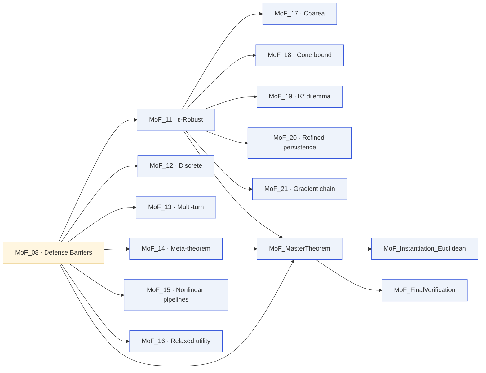

# Lean Dependency Graph

A zoomed-in view of how the 46 files in `ManifoldProofs/` depend on
each other.

## Top-level structure

```mermaid
flowchart TB
    classDef core fill:#fff6e0,stroke:#c78a00,color:#1d2433;
    classDef cost fill:#e6f4ea,stroke:#256a3a,color:#1d2433;
    classDef adv fill:#f6f2ff,stroke:#6b2ad1,color:#1d2433;
    classDef ext fill:#fde3e3,stroke:#9c2424,color:#1d2433;
    classDef capstone fill:#eef3fb,stroke:#3455db,color:#1d2433;

    subgraph Core["Core theory · MoF_01 – MoF_10"]
      direction TB
      F01["01 · Foundations"]:::core
      F02["02 · Basin Structure"]:::core
      F03["03 · Threshold Crossing"]:::core
      F04["04 · Lipschitz Basin"]:::core
      F05["05 · Monotone Convergence"]:::core
      F06["06 · Transferability"]:::core
      F07["07 · Authority Monotonicity"]:::core
      F08["08 · Defense Barriers"]:::core
      F09["09 · Dimensional Scaling"]:::core
      F10["10 · Gradient Attack"]:::core
    end

    subgraph Cost["Cost theory · MoF_Cost_01 – 10"]
      direction TB
      C1["Ball / Basin volume"]:::cost
      C2["Hitting time"]:::cost
      C3["Concentration"]:::cost
      C4["Attack / Defense cost"]:::cost
      C5["Unified cost asymmetry"]:::cost
    end

    subgraph Adv["Advanced · MoF_Adv_01 – 10"]
      direction TB
      A1["Basin connectedness"]:::adv
      A2["Boundary dimension"]:::adv
      A3["Fine-tuning stability"]:::adv
      A4["Optimization landscape"]:::adv
      A5["Measure bounds"]:::adv
    end

    subgraph Ext["Extensions"]
      direction TB
      E11["11 · ε-Robust"]:::ext
      E12["12 · Discrete"]:::ext
      E13["13 · Multi-turn + stochastic"]:::ext
      E14["14 · Meta-theorem"]:::ext
      E15["15 · Nonlinear pipelines"]:::ext
      E16["16 · Relaxed Utility"]:::ext
      E17["17 · Coarea"]:::ext
      E18["18 · Cone bound"]:::ext
      E19["19 · Optimal defense / K*"]:::ext
      E20["20 · Refined persistence"]:::ext
      E21["21 · Gradient chain"]:::ext
      ER["Continuous Relaxation (Tietze)"]:::ext
    end

    subgraph Capstone["Capstone"]
      direction TB
      MT["MoF_MasterTheorem"]:::capstone
      IE["MoF_Instantiation_Euclidean"]:::capstone
      FV["MoF_FinalVerification"]:::capstone
    end

    F08 --> E11
    F08 --> E12
    F08 --> E13
    F08 --> E14
    F08 --> E15
    F08 --> E16
    E11 --> E17
    E11 --> E18
    E11 --> E19
    E11 --> E20
    E11 --> E21
    ER --> F08
    F08 --> MT
    E11 --> MT
    E13 --> MT
    E14 --> MT
    E15 --> MT
    MT --> IE
    MT --> FV
```



## Verification metadata

- **Lean 4.28.0** + **Mathlib v4.28.0**
- **Zero `sorry`** statements across all 46 files
- **Zero custom axioms.** The artifact relies on Lean's three standard
  axioms only: `propext`, `Classical.choice`, `Quot.sound`.
- `lake build` succeeds with no errors.

### Re-running the verification

```bash
cd ManifoldProofs
lake build
```

This builds all 46 files; expect a few minutes on a warm Mathlib
cache. `MoF_FinalVerification` cross-checks that the master theorem
depends on exactly the stated axioms.

## Which files depend on `MoF_08_DefenseBarriers`

`MoF_08` is the continuous-case core. Everything downstream either
imports it directly or depends on something that does.



## Where to start reading Lean

- **First-time reader:** `MoF_08_DefenseBarriers` — eight theorems,
  ~200 lines, every proof is directly readable.
- **Quantitative tier:** `MoF_11_EpsilonRobust` — Lipschitz bound +
  positive-measure band.
- **Discrete tier:** `MoF_12_Discrete` — finite-set counting.
- **Unified view:** `MoF_14_MetaTheorem` — the two-line master argument.
- **Capstone:** `MoF_MasterTheorem` — the packaged version used in the
  paper.
