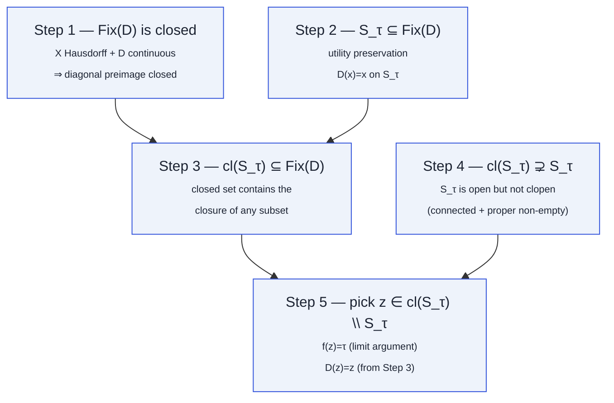
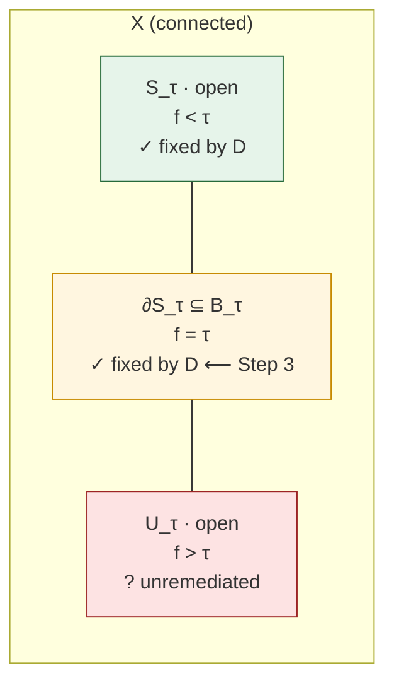

# T1 · Boundary Fixation

<span class="tier-pill t1">Tier 1</span>
Paper Theorem 4.1 · Lean module `MoF_08_DefenseBarriers`

The most fundamental result in the paper: any continuous
utility-preserving wrapper must fix at least one boundary point.

## Statement

::: theorem
Let $X$ be a connected Hausdorff space. Let $f\colon X\to\mathbb{R}$ be
continuous with $S_\tau,U_\tau\ne\emptyset$, and let $D\colon X\to X$ be
continuous with $D|_{S_\tau}=\mathrm{id}$. Then

$$
\exists\, z\in X\ \text{ with }\ f(z)=\tau\ \text{ and }\ D(z)=z.
$$

Moreover every $z\in \mathrm{cl}(S_\tau)\setminus S_\tau$ satisfies
$f(z)=\tau$ and $D(z)=z$, and this set is non-empty.
:::

## The five-step proof



::: details Step-by-step narrative
1. **Fix(D) is closed.** In a Hausdorff space the diagonal
   $\Delta=\{(x,x)\}\subset X\times X$ is closed. The map
   $x\mapsto(D(x),x)$ is continuous, so its preimage of $\Delta$ — which
   is exactly $\mathrm{Fix}(D)$ — is closed.
2. **Safe set is inside Fix(D).** Utility preservation literally says
   $D(x)=x$ for $x\in S_\tau$, i.e. $S_\tau\subseteq\mathrm{Fix}(D)$.
3. **Closure of safe set is inside Fix(D).** A closed set that contains
   a subset $A$ also contains $\mathrm{cl}(A)$. Combining steps 1 and 2
   gives $\mathrm{cl}(S_\tau)\subseteq\mathrm{Fix}(D)$.
4. **$S_\tau$ is not closed.** $S_\tau$ is a non-empty proper open
   subset of the connected space $X$ (because $U_\tau\ne\emptyset$, so
   $S_\tau\ne X$). Connectedness forbids non-trivial clopen subsets,
   so $S_\tau$ cannot equal its own closure. Hence
   $\mathrm{cl}(S_\tau)\setminus S_\tau\ne\emptyset$.
5. **The boundary point is fixed.** Pick any
   $z\in\mathrm{cl}(S_\tau)\setminus S_\tau$. By continuity
   $f(z)\le\tau$ (limit of values $<\tau$). Since $z\notin S_\tau$ we
   also have $f(z)\ge\tau$. Hence $f(z)=\tau$. And from step 3,
   $D(z)=z$.
:::

## The geometric picture



Utility preservation forces $D$ to be the identity on the green region;
continuity + closure of the fixed-point set forces $D$ to be the identity
on the yellow boundary. This is the single point (at least) at which
the defense passes a non-safe prompt through **without remediation**.

## Relaxing utility preservation

Strict identity on $S_\tau$ is **not** necessary for the impossibility.

::: theorem
**Score-preserving defense.** If $f(D(x))=f(x)$ for every $x\in S_\tau$,
then $\exists z$ with $f(z)=\tau$ and $f(D(z))=\tau$.
:::

::: theorem
**$\varepsilon$-approximate preservation.** If
$|f(D(x))-f(x)|\le\varepsilon$ on $S_\tau$, then
$\exists z$ with $f(z)=\tau$ and $f(D(z))\ge\tau-\varepsilon$.
:::

Both follow from the same closure argument applied to the continuous map
$h=f\circ D-f$: the level set $\{h\ge -\varepsilon\}$ is closed and
contains $S_\tau$, hence $\mathrm{cl}(S_\tau)$. See the paper Thms 4.3–4.4
and Lean `MoF_16_RelaxedUtility`.

## In Lean

The Lean formalization splits the five-step proof into the following
theorems inside `MoF_08_DefenseBarriers`:

```lean
-- Step 1 · Fix(D) is closed in a T2 space
theorem defense_fixes_closure
    [TopologicalSpace X] [T2Space X]
    {D : X → X} (hD : Continuous D) :
    IsClosed {x : X | D x = x}

-- Steps 2–3 · closure of the safe set is fixed
theorem closure_safe_subset_fixedPoints
    (hD : Continuous D)
    (h_safe : ∀ x, f x < τ → D x = x) :
    closure {x : X | f x < τ} ⊆ {x : X | D x = x}

-- Steps 4–5 · the capstone
theorem defense_incompleteness
    [T2Space X] [ConnectedSpace X]
    (hf : Continuous f) (hD : Continuous D)
    (h_safe : ∀ x, f x < τ → D x = x)
    (h_nonempty_safe : ∃ x, f x < τ)
    (h_nonempty_unsafe : ∃ x, τ < f x) :
    ∃ z, f z = τ ∧ D z = z
```

The full `MoF_08_DefenseBarriers` file contains eight theorems assembling
the proof, with **zero `sorry`** and only Lean's three standard axioms.

## Where it goes next

- Upgrade to a **Lipschitz-constrained neighborhood** — [T2 ·
  ε-Robust](/theorems/eps-robust).
- Upgrade to a **positive-measure unsafe region** under transversality —
  [T3 · Persistent](/theorems/persistent).
- Abstract the same argument to the **meta-theorem** that also covers
  the discrete and stochastic cases — [here](/theorems/meta-theorem).
