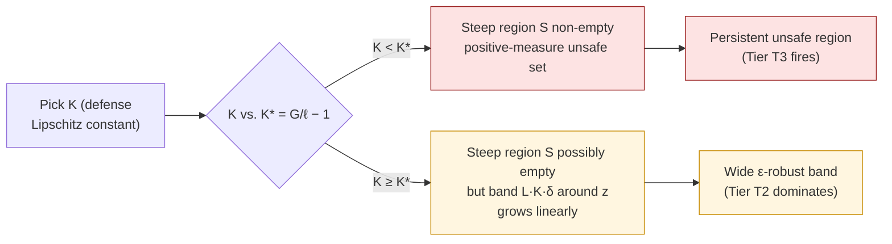
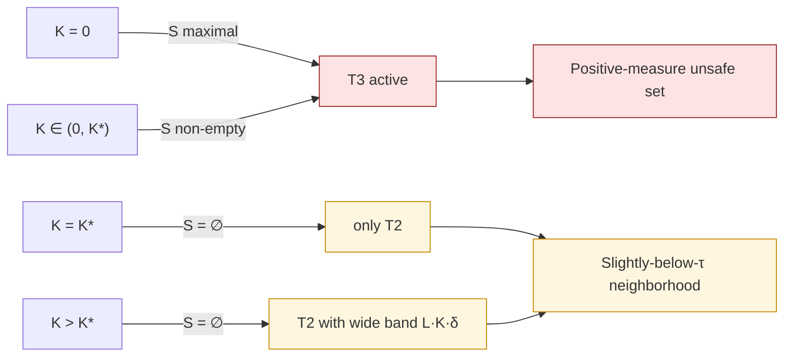

# Defense Dilemma (K*)

Paper Theorem 7.3 · Lean module `MoF_19_OptimalDefense`

The defense designer faces a fundamental trade-off when picking the
defense's Lipschitz constant $K$.

## Statement

::: theorem
**Defense dilemma.** Assume $f$ is differentiable at the boundary point
$z$ with gradient norm $G=\|\nabla f(z)\|$, and let $\ell$ be the
defense-path Lipschitz constant. Set

$$
K^\star \;=\; \frac{G}{\ell} - 1.
$$

Then exactly one of the two horns must hold:

1. **If $K<K^\star$:** $G>\ell(K+1)$, so the persistent steep region of
   [T3](/theorems/persistent) is non-empty and the defense fails on a
   positive-measure set.
2. **If $K\ge K^\star$:** $\ell(K+1)\ge G$, so the
   [T2 ε-robust bound](/theorems/eps-robust)
   $\tau-\ell(K+1)\delta$ becomes loose enough that the theorem can no
   longer rule out the defense from succeeding on the steep region —
   but the defense's Lipschitz constant has now grown so large that
   the **band of barely-touched points around $z$** widens
   correspondingly.
:::

## The shape of the trade-off



The dilemma is sharpest precisely when the alignment surface is
**anisotropic** ($\ell\ll L$). In the isotropic case $\ell = L$ and
$K^\star\le 0$, which means horn (1) is vacuous and only the band
trade-off remains.

## Why $K^\star = G/\ell - 1$

It's a one-line algebraic rearrangement of the transversality condition:

$$
G > \ell(K+1) \iff K < \frac{G}{\ell} - 1 = K^\star.
$$

So $K^\star$ is exactly the value of $K$ at which the steep region
collapses.

## Behavior across the dilemma

| $K$ regime | Steep region $\mathcal S$ | $\varepsilon$-robust band | Net failure |
|---|---|---|---|
| $K=0$ (constant) | maximal | maximal | both maxed |
| $K\in(0,K^\star)$ | non-empty | shrinks linearly | T3 dominates |
| $K=K^\star$ | empty | maximal | T2 dominates |
| $K>K^\star$ | empty | grows with $K$ | T2 dominates with wider band |



## In Lean

```lean
-- Threshold value: K* = G/ℓ - 1
def K_star (G ℓ : ℝ) (hℓ : 0 < ℓ) : ℝ := G / ℓ - 1

-- The two horns
theorem optimal_K_dichotomy
    (G L : ℝ) (hL : 0 < L) :
    (∀ K, K < K_star G L hL → ∃ S, …)   -- horn (1): persistent region
    ∧
    (∀ K, K_star G L hL ≤ K → ∃ band, …) -- horn (2): wide band

-- Existence of an "optimal" K, taken from the boundary
theorem optimal_K_exists : …
```

Lean's statement is parameterized over generic positive reals
$(G,L)$; instantiating $L\mapsto\ell$ recovers the defense-path version
above.

## What this means in practice

There is **no $K$ that escapes both tiers**:

* small $K$ → narrow band but a positive-measure persistent unsafe region;
* large $K$ → no provable persistent region but a wide
  near-threshold band the defense cannot push far below $\tau$.

The dilemma is one of the cleanest concrete consequences of the
trilemma: even if you somehow discovered the model's Lipschitz constants
exactly, you would still face this irreducible trade-off in defense
design.

## Next

- [Pipeline Degradation](/theorems/pipeline) — what happens when $K$
  becomes $K^n$ along an agent tool-chain.
- [Volume bounds](/theorems/volume-bounds) — explicit lower bounds for
  both the band and the persistent region.
