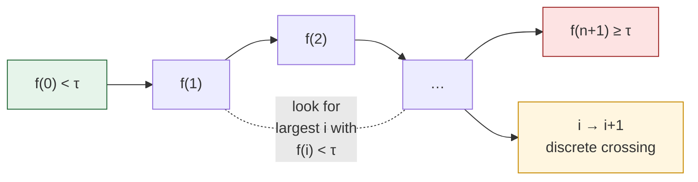
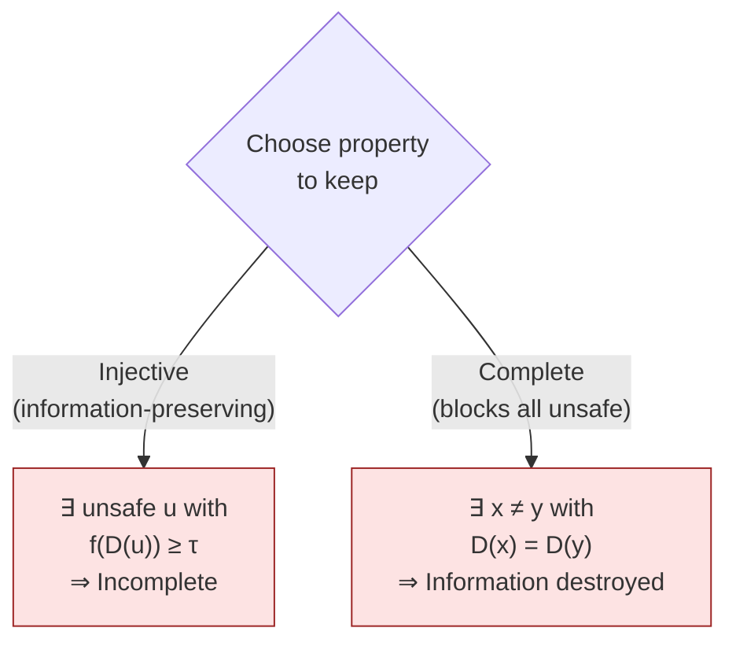

# Discrete Impossibility

Paper Theorem 8.2–8.3 · Lean module `MoF_12_Discrete`

The discrete dilemma proves the same impossibility on finite sets, using
only counting and induction — **no topology, no continuity, no measure**.
It answers the natural objection "maybe the impossibility is an artifact
of continuous relaxation".

## Discrete Intermediate Value Theorem

::: theorem
Let $f\colon\{0,1,\dots,n+1\}\to\mathbb{R}$ with $f(0)<\tau$ and
$f(n+1)\ge\tau$. Then there exists $i\in\{0,\dots,n\}$ with
$f(i)<\tau$ and $f(i+1)\ge\tau$.
:::

Pure induction: walk along the sequence and look at the largest $i$
with $f(i)<\tau$. The step $i\to i+1$ is the discrete analogue of a
boundary crossing.



## Discrete Defense Dilemma

::: theorem
Let $X$ be a finite set with $S_\tau,U_\tau\ne\emptyset$, and
$D\colon X\to X$ utility-preserving ($D(x)=x$ whenever $f(x)<\tau$).

1. **If $D$ is injective**, then $f(D(u))\ge\tau$ for every $u$ with
   $f(u)\ge\tau$ (including boundary points): the defense is
   **incomplete**.
2. **If $D$ is complete** ($f(D(x))<\tau$ for all $x$), then $D$ is
   **non-injective**: there exist distinct $x\ne y$ with $D(x)=D(y)$.
:::

### One-paragraph proof

For horn (1): assume $D$ is injective and $f(D(u))<\tau$. Then $D(u)$ is
safe, so utility preservation gives $D(D(u))=D(u)$. Injectivity forces
$D(u)=u$, so $f(u)=f(D(u))<\tau$, contradicting $f(u)\ge\tau$.

For horn (2): for any $u\in U_\tau$, completeness gives $f(D(u))<\tau$,
so $D(D(u))=D(u)$. But $u\ne D(u)$ (they have different $f$-values),
giving a collision.



## What the horns actually mean

| Horn | Property kept | Price paid |
|---|---|---|
| (1) | Injective defense — every input gets a distinct output | Some unsafe input passes through with $f(D(u))\ge\tau$ |
| (2) | Complete defense — every output is safe | Distinct inputs collide: the downstream model cannot distinguish them |

The continuous trilemma trades **continuity** for completeness; the
discrete dilemma trades **injectivity** for completeness. Part (1) is
the real bite: an **information-preserving** defense cannot eliminate
unsafe outputs. Any complete defense must destroy information, which
means the downstream model receives the same input regardless of
whether the original was safe or an attack. Any audit or
attack-detection logic must act **before** $D$ is applied.

## Capacity exhaustion

A corollary: when the adversary controls more inputs than the defense
can distinguish, pigeonhole-style arguments force collisions.

::: theorem
**Capacity pigeonhole.** Let the adversarial input class have size $A$
and the defense's effective output class have size $C<A$. Then $D$
cannot be injective on the adversarial class; some pair of distinct
adversarial inputs produces the same output.
:::

The paper pushes this further: the configuration space grows as $2^{2^d}$
in the effective dimension $d$, while any polynomial-capacity defense
fails asymptotically (`doubly_exponential_overwhelms` in
`MoF_12_Discrete`).

## In Lean

```lean
-- Discrete IVT — pure counting argument
theorem discrete_ivt {n : ℕ} (f : Fin (n+2) → ℝ) (τ : ℝ)
    (h_start : f 0 < τ) (h_end : f ⟨n+1,…⟩ ≥ τ) :
    ∃ i : Fin (n+1),
      f ⟨i.val, …⟩ < τ ∧ f ⟨i.val+1, …⟩ ≥ τ

-- Non-injectivity for complete defenses
theorem discrete_defense_non_injective
    (hD_safe : ∀ x, f x < τ → D x = x)
    (hD_complete : ∀ x, f (D x) < τ)
    (u : X) (hu : f u ≥ τ) :
    ∃ x y, x ≠ y ∧ D x = D y

-- Capacity exhaustion
theorem defense_capacity_pigeonhole : …
theorem doubly_exponential_overwhelms : …
```

The whole file sits in `MoF.Discrete` and uses only `Finset` and
elementary Lean tactics; it has no topological imports at all.

## Why this is important

The discrete dilemma is a **sanity check** on the continuous theorems:
if continuous topology were somehow "too strong" and the impossibility
were an artifact, this counting argument should fail. It doesn't. The
same two-line reasoning — utility preservation forces $D$ to be the
identity on safe inputs, and completeness conflicts with that — fires
in both regimes.

## Next

- [Tietze bridge](/theorems/tietze) — the converse direction: finite
  observations _force_ a continuous model.
- [Meta-theorem](/theorems/meta-theorem) — the unified statement that
  subsumes both paths.
