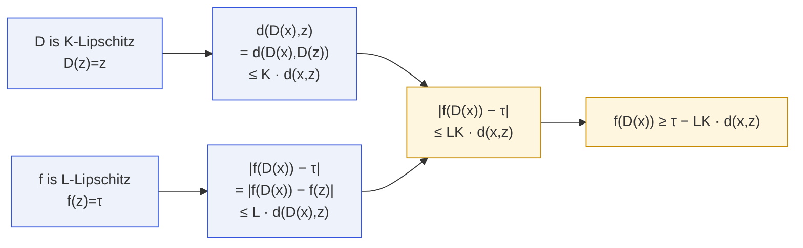
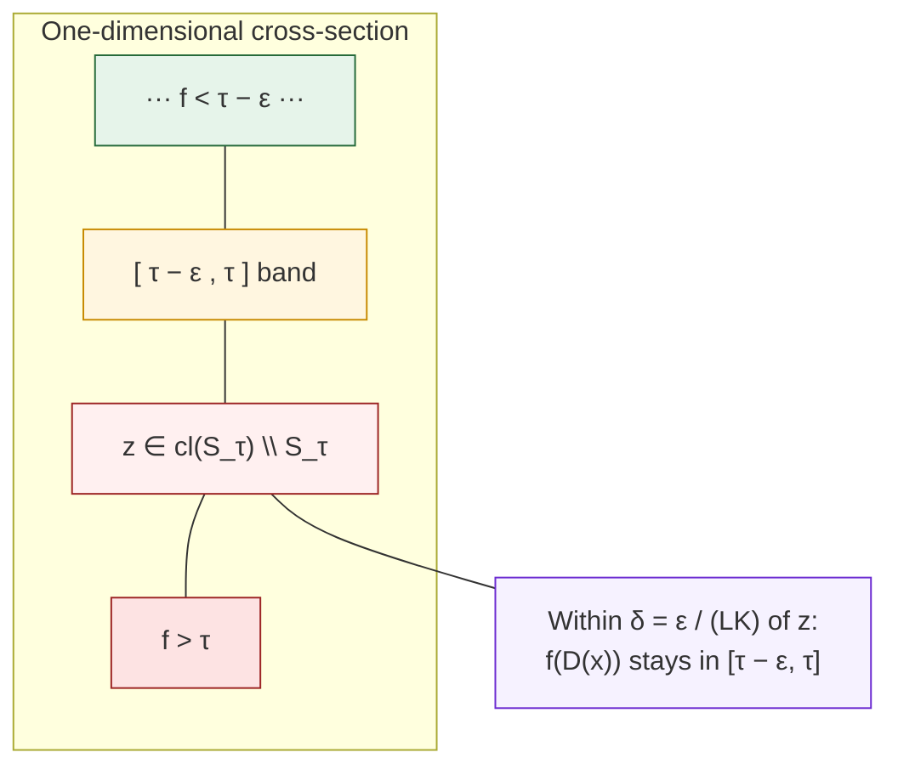

# T2 · ε-Robust Constraint

<span class="tier-pill t2">Tier 2</span>
Paper Theorem 5.1 · Lean module `MoF_11_EpsilonRobust`

Boundary fixation gives a **single** point that the defense cannot move.
Lipschitz regularity spreads the failure to a **neighborhood**.

## Statement

::: theorem
Let $(X,d)$ be a connected Hausdorff **metric** space. Let
$f\colon X\to\mathbb{R}$ be continuous and $L$-Lipschitz, and let
$D\colon X\to X$ be continuous, $K$-Lipschitz, and utility-preserving with
$S_\tau,U_\tau\ne\emptyset$. Let $z$ be the fixed boundary point from
[T1](/theorems/boundary-fixation). Then for every $x\in X$,

$$
\boxed{\; f(D(x)) \;\ge\; \tau \;-\; L\,K\,d(x,z). \;}
$$

In particular the defense cannot push any point within distance
$\delta$ of $z$ more than $LK\delta$ below the threshold.
:::

## Why the bound holds

The proof is a two-line chain of triangle inequalities:



## Picture: the ε-band the defense cannot clear



::: theorem
**Positive-measure $\varepsilon$-band.** Under the hypotheses above, if
$f$ also takes some value below $\tau-\varepsilon$, then

$$
B\!\left(c,\frac{\varepsilon}{4L}\right) \;\subseteq\;
\mathcal B_\varepsilon
\;=\;\{x:\tau-\varepsilon\le f(x)\le \tau\}
$$

where $c$ is any point with $f(c)=\tau-\varepsilon/2$ (exists by the IVT).
In particular $\mathcal B_\varepsilon$ has positive measure under any
measure that gives non-empty open sets positive weight.
:::

### A short proof of the band bound

Let $c$ satisfy $f(c)=\tau-\varepsilon/2$. For $y\in B(c,\varepsilon/(4L))$:
$$
|f(y)-f(c)|\;\le\;L\cdot\frac{\varepsilon}{4L}\;=\;\frac{\varepsilon}{4},
$$
so $f(y)\in[\tau-3\varepsilon/4,\ \tau-\varepsilon/4]\subset
[\tau-\varepsilon,\tau]$, i.e. $y\in\mathcal B_\varepsilon$.

## What T2 buys you over T1

| Property | T1 · Boundary Fixation | T2 · ε-Robust |
|---|---|---|
| Kind of failure | single point | bounded region |
| Hypothesis on $X$ | Hausdorff + connected | + metric structure |
| Hypothesis on $f$, $D$ | continuous | continuous + Lipschitz |
| Measure of failure | 0 | positive |
| Upgradable to T3? | — | yes, via transversality |

## Notes and caveats

- On the $\varepsilon$-band itself the defense is forced to act as the
  identity on the open part ($f(x)<\tau$ by utility preservation) and to
  fix the boundary-of-$S_\tau$ part by T1. The only points on the band
  where $D$ has any freedom are boundary points **outside**
  $\mathrm{cl}(S_\tau)$, which for Lipschitz $f$ on $\mathbb{R}^n$ form
  a measure-zero level set.
- The bound $LK\delta$ is tight: both linear $f$ and scaled $D$ achieve
  equality.

## In Lean

`MoF_11_EpsilonRobust` contains the whole tier T2:

```lean
-- Lipschitz defense barely moves points near its fixed points
theorem defense_fixes_nearby
    {D : X → X} {K : ℝ≥0} (hD : LipschitzWith K D)
    {z x : X} (hz : D z = z) :
    dist (D x) x ≤ (↑K + 1) * dist x z

-- The core bound
theorem defense_output_near_threshold
    (hf : LipschitzWith L f) (hD : LipschitzWith K D)
    (hz : D z = z) (hfz : f z = τ) :
    |f (D x) - τ| ≤ (↑L * ↑K) * dist x z

-- The band has positive measure
theorem epsilon_band_positive_measure
    (hf : LipschitzWith L f) …

-- Master bundling theorem
theorem epsilon_robust_impossibility : …
```

## Next

- [T3 · Persistent Unsafe Region](/theorems/persistent) — when the
  Lipschitz budget is too small to flatten $f$ on a neighborhood.
- [Defense Dilemma (K\*)](/theorems/defense-dilemma) — the designer's
  trade-off in choosing $K$.
- [Volume bounds](/theorems/volume-bounds) — explicit lower bounds on
  $|\mathcal B_\varepsilon|$ and on the persistent set.
