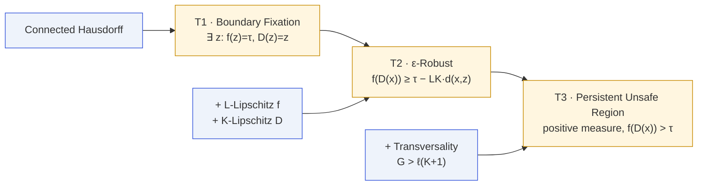

# Theorems

Every major theorem in the paper, ordered from the weakest hypothesis to
the strongest conclusion. The first three form the central **three-tier
escalation**; the rest extend the same machinery to discrete, multi-turn,
stochastic, and pipelined settings.

## The three tiers at a glance

<table class="tier-table">
<thead>
<tr><th>Tier</th><th>Theorem</th><th>Extra hypothesis</th><th>Conclusion</th></tr>
</thead>
<tbody>
<tr>
  <td>T1</td>
  <td><a href="/theorems/boundary-fixation">Boundary Fixation</a></td>
  <td>connected + Hausdorff</td>
  <td>∃ z with f(z)=τ and D(z)=z</td>
</tr>
<tr>
  <td>T2</td>
  <td><a href="/theorems/eps-robust">ε-Robust Constraint</a></td>
  <td>f is L-Lipschitz, D is K-Lipschitz</td>
  <td>f(D(x)) ≥ τ − LK·d(x,z)</td>
</tr>
<tr>
  <td>T3</td>
  <td><a href="/theorems/persistent">Persistent Unsafe Region</a></td>
  <td>transversality: G &gt; ℓ(K+1)</td>
  <td>positive-measure set with f(D(x)) &gt; τ</td>
</tr>
</tbody>
</table>

## All theorems

### Core impossibility

- [**T1 · Boundary Fixation**](/theorems/boundary-fixation) —
  the pointwise result (paper Thm 4.1, Lean `MoF_08`).
- [**T2 · ε-Robust Constraint**](/theorems/eps-robust) —
  the Lipschitz neighborhood bound (paper Thm 5.1, Lean `MoF_11`).
- [**T3 · Persistent Unsafe Region**](/theorems/persistent) —
  the measure-theoretic result under transversality (paper Thm 6.3, Lean `MoF_11`).
- [**Defense Dilemma (K\*)**](/theorems/defense-dilemma) —
  the tradeoff in choosing the defense's Lipschitz constant
  (paper Thm 7.3, Lean `MoF_19`).

### Discrete and continuous

- [**Discrete Impossibility**](/theorems/discrete) —
  discrete IVT + non-injectivity dilemma; no topology required
  (paper Thm 8.2–8.3, Lean `MoF_12`).
- [**Continuous Relaxation (Tietze)**](/theorems/tietze) —
  the bridge from finitely many observations to the continuous theory
  (paper Thm 8.1, Lean `MoF_ContinuousRelaxation`).

### Extensions

- [**Multi-Turn Impossibility**](/theorems/multi-turn) — the impossibility
  recurs at every turn (paper Thm 9.1, Lean `MoF_13`).
- [**Stochastic Impossibility**](/theorems/stochastic) — expected behavior
  inherits boundary fixation (paper Thm 9.2, Lean `MoF_13`).
- [**Pipeline Degradation**](/theorems/pipeline) — Lipschitz constants
  multiply; depth makes defense **harder** (paper Thm 9.4, Lean `MoF_15`).

### Unification

- [**Meta-theorem**](/theorems/meta-theorem) — a single
  representation-independent statement that implies T1, the discrete
  dilemma, and the stochastic impossibility (Lean `MoF_14`).

### Quantitative bounds

- [**Volume bounds**](/theorems/volume-bounds) — explicit lower bounds
  on $|\mathcal B_\varepsilon|$ and the cone-based persistent region
  (paper Thm 7.1–7.2, Lean `MoF_17`, `MoF_18`).
