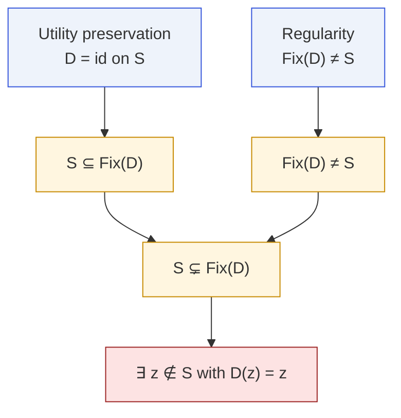
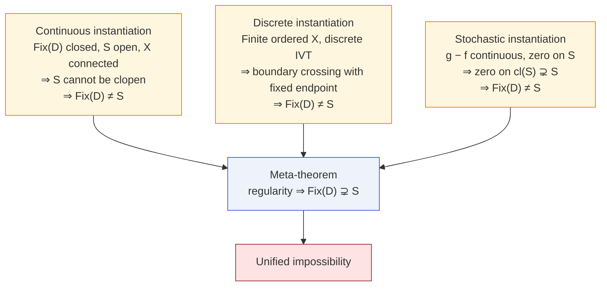

# Meta-Theorem — Regularity ⇒ Spillover

Paper Appendix · Lean module `MoF_14_MetaTheorem`

One sentence subsumes the continuous, discrete, and stochastic
impossibility arguments. It says: **any regularity condition that
forbids $\mathrm{Fix}(D)$ from exactly equaling the safe region forces
the fixed-point set to strictly contain it.**

## Statement

::: theorem
**Regularity implies spillover.** Let $S\subseteq X$ and
$D\colon X\to X$ be utility-preserving on $S$ (i.e. $D(x)=x$ for every
$x\in S$). Suppose in addition that

$$
\{x : D(x)=x\} \;\ne\; S
$$

(the "regularity" hypothesis: some structure prevents the fixed-point
set from being _exactly_ $S$). Then

$$
\{x : D(x)=x\} \;\supsetneq\; S.
$$
:::

Corollary: there is at least one **non-safe** fixed point of $D$.

## One diagram



The whole theorem is one line of set theory:
$S\subseteq\mathrm{Fix}(D)$ and $\mathrm{Fix}(D)\ne S$
$\Rightarrow S\subsetneq\mathrm{Fix}(D)$.

All the **hard work** is in showing that regularity —
"$\mathrm{Fix}(D)\ne S$" — actually holds. Each instantiation of the
meta-theorem provides a proof of this fact from the domain-specific
structure.

## Three instantiations



### Continuous case

$\mathrm{Fix}(D)$ is closed (Hausdorff + continuous $D$), $S$ is open
($f^{-1}((-\infty,\tau))$), and in a connected space a proper non-empty
open set cannot be clopen. Hence $\mathrm{Fix}(D)\ne S$.

### Discrete case

On a finite ordered set the discrete IVT (`discrete_ivt`) produces a
crossing point $i\to i+1$ with $f(i)<\tau\le f(i+1)$. The same
counting argument that powers `discrete_defense_non_injective` shows
$\mathrm{Fix}(D)\ne S$.

### Stochastic case

Set $g(x)=\mathbb{E}[f(D(x))]$ and $h=g-f$. Utility preservation gives
$h|_S = 0$. By continuity of $g$ and $f$, the zero set of $h$ is closed
and contains $S$, hence contains $\mathrm{cl}(S)\supsetneq S$. Every
new point of $\mathrm{cl}(S)\setminus S$ is a boundary point at which
$g$ also equals $\tau$.

## Why "bounded regularity" is the right abstraction

The three paths all look different on paper:

- continuous → topology,
- discrete → counting,
- stochastic → expectation.

But the thing they **actually use** is the same: _some_ mechanism that
forbids $\mathrm{Fix}(D)$ from being exactly $S$. Topology, IVT, and
continuous expectations are three different sources of that single
abstract fact.

## In Lean

```lean
-- Main theorem
theorem regularity_implies_spillover
    {X : Type*} {S : Set X} {D : X → X}
    (h_pres : ∀ x ∈ S, D x = x)
    (h_regularity : {x : X | D x = x} ≠ S) :
    S ⊂ {x : X | D x = x}

-- Corollary
theorem spillover_gives_non_safe_fixed_point
    (h_spillover : S ⊂ {x : X | D x = x}) :
    ∃ x, x ∉ S ∧ D x = x

-- Three instantiations of the regularity hypothesis
theorem continuous_regularity : …
theorem discrete_regularity   : …
theorem stochastic_regularity : …
```

Each instantiation discharges `h_regularity` from the appropriate
domain-specific structure and hands the result off to
`regularity_implies_spillover`.

## Next

- [Boundary Fixation](/theorems/boundary-fixation) — the continuous
  instantiation in full.
- [Discrete Impossibility](/theorems/discrete) — the counting
  instantiation.
- [Stochastic Impossibility](/theorems/stochastic) — the expected-score
  instantiation.
