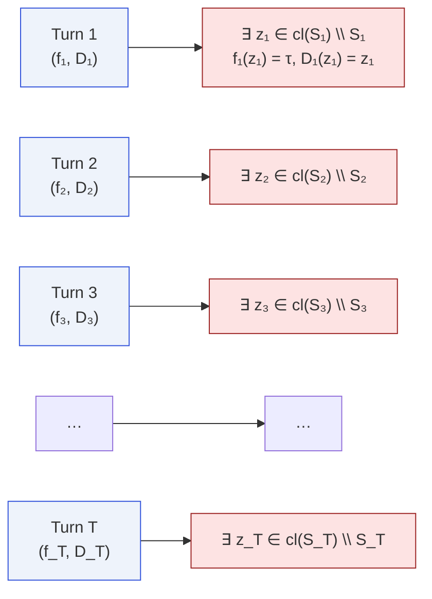
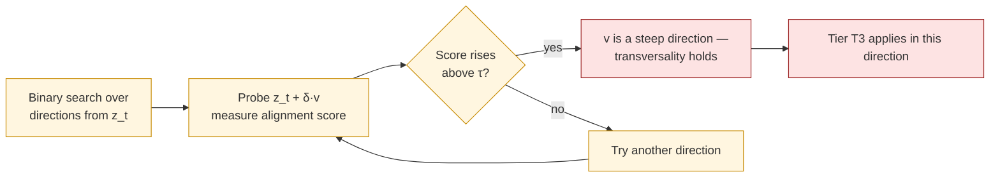

# Multi-Turn Impossibility

Paper Theorem 9.1 · Lean module `MoF_13_MultiTurn`

Multi-turn interaction does not buy the defender anything: the
impossibility recurs at **every** turn.

## Statement

::: theorem
Let $\{(f_t,D_t)\}_{t=1}^T$ be alignment functions and defenses over
$T$ turns on a connected Hausdorff space $X$, each continuous,
utility-preserving, with $S_\tau^{(t)},U_\tau^{(t)}\ne\emptyset$ at
every turn. Then for every turn $t$ there exists $z_t$ with
$f_t(z_t)=\tau$ and $D_t(z_t)=z_t$.
:::

The proof is trivial: [T1](/theorems/boundary-fixation) fires once per
turn.

## Per-turn boundary fixation



::: remark
**History dependence is free.** The functions $f_t,D_t$ may depend on
the full history of the conversation — this does not matter. Each
turn is a fresh instance of the single-turn impossibility, so the
dependence simply sits inside the continuous functions we apply
[T1](/theorems/boundary-fixation) to.
:::

## Why it gets worse for the defender

The attacker, not the defender, benefits from the extra degree of
freedom.

### Attacker's best observation is monotone

Let $M_t=\max_{s\le t} f_s(x_s)$ be the attacker's best observed
alignment-deviation score up to turn $t$. By construction $M_t$ is
non-decreasing: the attacker's best attack cannot get worse as the
conversation progresses.

### Steering toward transversality



The paper and the Lean file formalize this as
`transversality_reachable`: under mild assumptions, the attacker can
**steer** the conversation toward a configuration where tier T3 bites.
The defender has no symmetric steering lemma.

## Capacity parity disadvantage

Even if attacker and defender have equal "capacity" (say, equal
description length), the defender loses effective capacity because part
of it is consumed by **utility preservation**: every safe input is a
constraint that fixes $D$ at that point.

::: theorem
**Capacity parity disadvantage.** Let $\mathcal A$ and $\mathcal D$ be
the space of attackers and defenders, both of cardinality $N$. If the
defender must be utility-preserving on a safe set of size $m$, the
effective defender space has at most $N-m$ degrees of freedom.
The attacker has none of this tax.
:::

## In Lean

```lean
structure MultiTurnSystem (X : Type*) [TopologicalSpace X] where
  T : ℕ
  f : Fin T → (X → ℝ)
  D : Fin T → (X → X)
  τ : ℝ

-- Main theorem: boundary fixation at every turn
theorem multi_turn_impossibility
    [T2Space X] [ConnectedSpace X]
    (sys : MultiTurnSystem X)
    (h_cont_f : ∀ t, Continuous (sys.f t))
    (h_cont_D : ∀ t, Continuous (sys.D t))
    (h_preserve : ∀ t x, sys.f t x < sys.τ → sys.D t x = x)
    (h_nontrivial : ∀ t, (∃ x, sys.f t x < sys.τ) ∧ (∃ x, sys.τ < sys.f t x)) :
    ∀ t, ∃ z, sys.f t z = sys.τ ∧ sys.D t z = z

-- Attacker benefits
theorem running_max_monotone : …
theorem transversality_reachable : …
theorem capacity_parity_disadvantage : …
```

## Next

- [Stochastic Impossibility](/theorems/stochastic) — randomization
  doesn't help either.
- [Pipeline Degradation](/theorems/pipeline) — what happens when turns
  involve tool calls.
