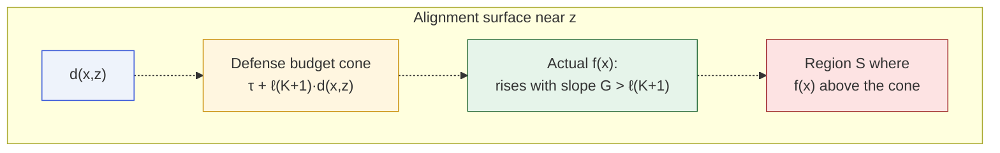
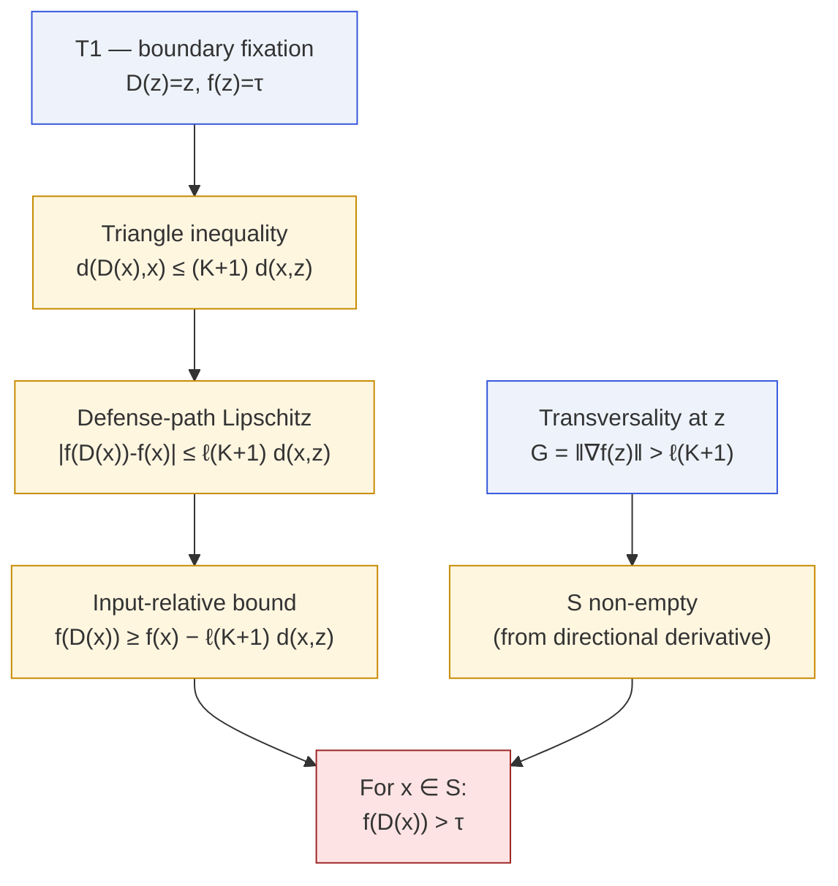

# T3 · Persistent Unsafe Region

<span class="tier-pill t3">Tier 3</span>
Paper Theorem 6.3 · Lean module `MoF_11_EpsilonRobust`

Tier T2 pushes near-boundary points close to $\tau$ but still **below** it.
Tier T3 upgrades "close to" into **strictly above** $\tau$ on a
positive-measure region: when the alignment surface rises faster than the
defense's Lipschitz budget, the defense loses.

## Statement

::: theorem
Let $X$ be a connected Hausdorff metric space, $f$ continuous and
$L$-Lipschitz, $D$ continuous, $K$-Lipschitz, and utility-preserving.
Let $z\in\mathrm{cl}(S_\tau)\setminus S_\tau$ be the fixed boundary point
and $\ell\le L$ the defense-path Lipschitz constant. Define the
**steep region**

$$
\mathcal S \;=\; \{x\in X : f(x) > \tau + \ell(K+1)\,d(x,z)\}.
$$

If $\mathcal S\ne\emptyset$, then:

1. $\mathcal S$ is **open**;
2. $\mathcal S$ has **positive measure** (under any measure positive on
   non-empty open sets);
3. for every $x\in\mathcal S$, $f(D(x)) > \tau$.
:::

## The budget picture

The defense has a finite "budget" for how much it can reduce $f$ along
its own motion. The paper's key lemma bounds this budget:

::: lemma
**Input-relative bound.** For every $x\in X$,
$$
f(D(x)) \;\ge\; f(x)\;-\;\ell(K+1)\,d(x,z).
$$
:::

### Proof of the lemma

$$
\begin{aligned}
d(D(x),x)\;&\le\;d(D(x),z)+d(z,x)\;\le\;K\,d(x,z)+d(x,z)\;=\;(K+1)\,d(x,z),\\[4pt]
|f(D(x))-f(x)|\;&\le\;\ell\,d(D(x),x)\;\le\;\ell(K+1)\,d(x,z).
\end{aligned}
$$

So $D$ can reduce $f$ by **at most** $\ell(K+1)d(x,z)$. If $f$ at
$x$ exceeds $\tau$ by more than this budget, $f(D(x))$ is still above
$\tau$. That's exactly the defining inequality of the steep region.

## The picture



Geometrically, the defense can only pull $f$ down along a cone of slope
$\ell(K+1)$ rooted at the fixed boundary point. Wherever $f$ rises above
that cone, the persistent unsafe region lives.

## Where the conditions come from



::: remark
**The role of $\ell$.** The paper crucially distinguishes the global
Lipschitz constant $L$ of $f$ from the **defense-path** Lipschitz
constant $\ell$ — the steepness of $f$ **in the direction $D$ actually
moves**. On isotropic surfaces $\ell=L$ and tier T3 is vacuous. On
anisotropic surfaces $\ell\ll L$ and the steep region is wide.
:::

## Non-vacuousness via the gradient

In a normed space, the steep region is non-empty as soon as the Fréchet
derivative of $f$ at $z$ is large enough.

::: lemma
**Transversality from directional derivative.** If $f$ has
Fréchet derivative $f'$ at the boundary point $z$ and there is a unit
vector $v$ with $f'(z)\cdot v>\ell(K+1)$, then $z+tv\in\mathcal S$ for
sufficiently small $t>0$. In particular, if
$\|f'(z)\|>\ell(K+1)$ such a $v$ exists.
:::

This is the content of `gradient_norm_implies_steep_nonempty` in
`MoF_21_GradientChain`, which derives the local growth bound directly
from `HasFDerivAt` rather than assuming it.

## How big is $\mathcal S$?

Part (2) of the theorem says $\mathcal S$ is open and therefore of
positive measure — qualitatively. Explicit lower bounds live in the
[Volume bounds](/theorems/volume-bounds) page:

- **Coarea bound** (`MoF_17_CoareaBound`): if $f$ is $L$-Lipschitz on
  $\mathbb R^n$ and there exists $c$ with $f(c)=\tau-\varepsilon/2$, then
  $\mu(\mathcal B_\varepsilon)\ge V_n\bigl(\varepsilon/(4L)\bigr)^n$.
- **Cone bound** (`MoF_18_ConeBound`): if $f(x)\ge\tau+c(x-z)$ on an
  interval of length $\delta_0$ with $c>\ell(K+1)$, then
  $\mu\{x:f(D(x))>\tau\}\ge \delta_0$.

## In Lean

```lean
-- The steep region is open and non-empty under the gradient hypothesis
theorem steep_region_open : …
theorem steep_region_nonempty_of_grad : …

-- Persistence on the steep region
theorem persistent_unsafe_region
    (hf : LipschitzWith L f) (hD : LipschitzWith K D)
    (hD_safe : ∀ x, f x < τ → D x = x)
    (z : X) (hz : z ∈ closure {x | f x < τ} \ {x | f x < τ})
    (h_steep : x ∈ steep_region z ℓ K τ) :
    f (D x) > τ
```

The LaTeX Thm 6.3 corresponds directly to the Lean
`persistent_unsafe_region`, and its positive-measure consequence is
`persistent_positive_measure`.

## Next

- [Defense Dilemma (K\*)](/theorems/defense-dilemma) — the tradeoff in
  picking $K$ when you know the gradient norm $G$.
- [Volume bounds](/theorems/volume-bounds) — explicit lower bounds.
- [Pipeline Degradation](/theorems/pipeline) — when $K$ becomes $K^n$.
