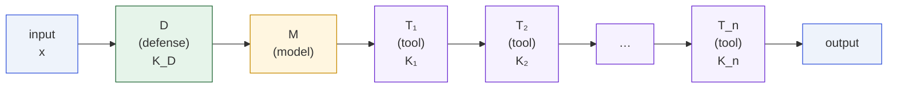
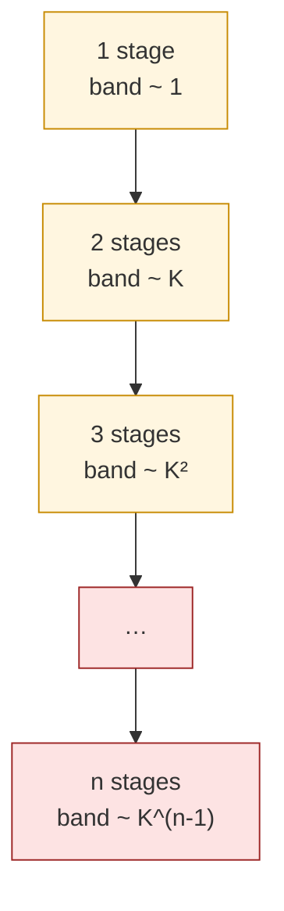

# Pipeline Degradation

Paper Theorem 9.4 · Lean module `MoF_15_NonlinearAgents`

Agent pipelines with tool calls are compositions of Lipschitz maps. The
effective Lipschitz constant is the **product**, so deeper pipelines are
**harder** to defend, not easier.

## Statement

::: theorem
**Pipeline Lipschitz degradation.** If $T_1,\dots,T_n$ are Lipschitz
with constants $K_1,\dots,K_n$, then the composed pipeline
$T_n\circ\cdots\circ T_1$ is Lipschitz with constant
$\prod_i K_i$. For $n$ identical stages with constant $K\ge 2$, the
effective constant is $K^n$ — **exponential in depth**.
:::

::: theorem
**Pipeline impossibility.** If the composed pipeline
$P=T_n\circ\cdots\circ T_1\circ D$ is continuous and $P(x)=x$ for all
$x\in S_\tau$, then $P$ has boundary fixed points. If $D$ is
$K_D$-Lipschitz and each $T_i$ is $K$-Lipschitz, the $\varepsilon$-robust
band scales as $L\cdot K_D\cdot K^n\cdot\delta$.
:::

## The pipeline picture



Every box in the chain composes its Lipschitz constant with the
previous. What started as a small constant on a single-stage defense
becomes a product across the entire chain.

## Why the band explodes

For a single-stage defense with Lipschitz constants $(L,K)$ the T2 bound
is

$$
f(D(x)) \;\ge\; \tau \;-\; L\cdot K\cdot d(x,z).
$$

For the full pipeline $P=T_n\circ\cdots\circ T_1\circ D$,

$$
f(P(x)) \;\ge\; \tau \;-\; L\cdot K_D\cdot K^n\cdot d(x,z).
$$

The $\varepsilon$-robust band width around $z$ grows as
$\varepsilon / (L\cdot K_D\cdot K^n)$ **in the reverse direction** —
with each added tool call, the neighborhood the pipeline cannot
remediate gets exponentially wider.



## An explicit three-stage example

For three stages with Lipschitz constants $K_1,K_2,K_3$:

$$
\mathrm{Lip}(T_3\circ T_2\circ T_1\circ D)
\;\le\;K_3\cdot K_2\cdot K_1\cdot K_D.
$$

If $K_D=K_1=K_2=K_3=2$, a single-stage defense with band of
width 1 becomes a three-stage pipeline with band of width 8.
Ten stages at $K=2$ give width ≈ 1024.

## Why naive "defense in depth" is a misnomer

In classical security, stacking independent defenses generally helps
(probability of _all_ defenses failing is the product of individual
failure probabilities). In the Lipschitz wrapper setting, stacking
defenses is precisely what produces the $K^n$ blow-up, because the
effective Lipschitz constant is **multiplicative**, not additive.

::: remark
This does not contradict defense-in-depth as a general engineering
principle — it constrains a specific (and common) way of building it:
chaining continuous wrappers before the model. Discontinuous filters,
output-side monitoring, or human-in-the-loop review are not Lipschitz
compositions and are not covered.
:::

## In Lean

```lean
-- Composition of Lipschitz maps
theorem lipschitz_comp
    (hf : LipschitzWith Kf f) (hg : LipschitzWith Kg g) :
    LipschitzWith (Kf * Kg) (f ∘ g)

-- Two- and three-stage explicit bounds
theorem two_stage_lipschitz : …
theorem three_stage_lipschitz : …

-- Boundary fixation for pipelines
theorem pipeline_impossibility
    (hPipe : Continuous (T ∘ D))
    (hPipe_safe : ∀ x, f x < τ → (T ∘ D) x = x)
    (h_safe_ne : ∃ x, f x < τ)
    (h_unsafe_ne : ∃ x, τ < f x) :
    ∃ z, f z = τ ∧ (T ∘ D) z = z

-- ε-robust band grows with depth
theorem band_grows_with_depth : …
theorem tool_call_amplifies : …
```

The three-stage pipeline is a direct `LipschitzWith.comp` composition in
Mathlib; the amplification theorem is then the ordinary T2 bound applied
to $P$.

## Next

- [Defense dilemma](/theorems/defense-dilemma) — the single-stage
  trade-off that gets amplified across the pipeline.
- [Multi-Turn Impossibility](/theorems/multi-turn) — the temporal
  counter-part of this spatial pipeline.
