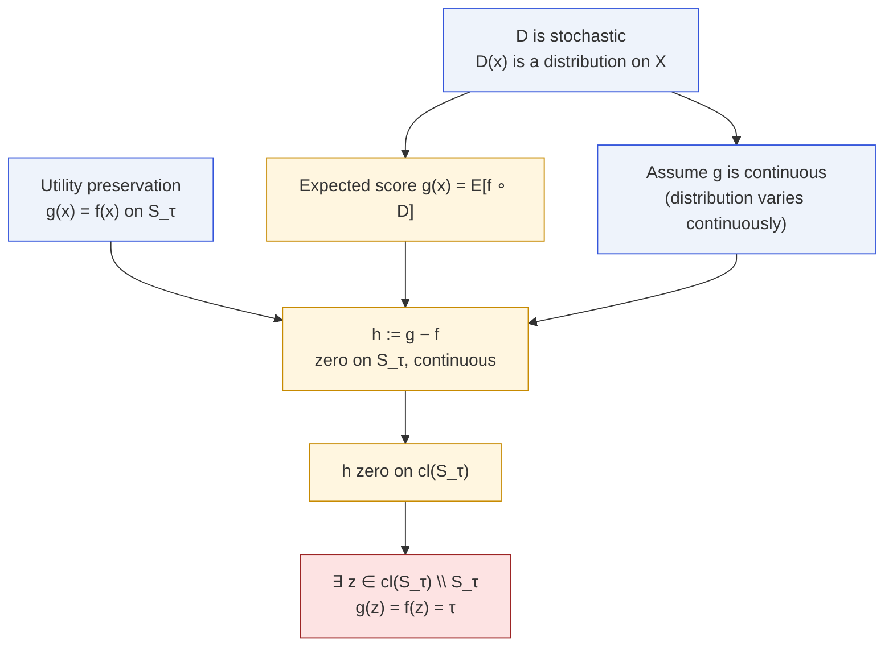
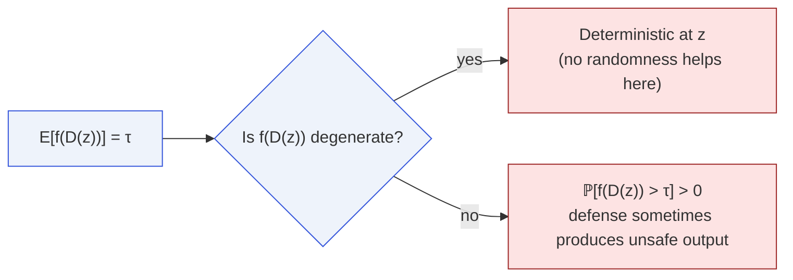

# Stochastic Impossibility

Paper Theorem 9.2 · Lean module `MoF_13_MultiTurn`

Randomizing the defense does not escape the trilemma: the expected
alignment score inherits boundary fixation.

## Statement

::: theorem
Let $X$ be a connected Hausdorff space, $f\colon X\to\mathbb{R}$
continuous with $S_\tau,U_\tau\ne\emptyset$. Let $D$ be a stochastic
defense and define the **expected-score map**

$$
g(x) \;=\; \mathbb{E}_{y\sim D(x)}[\,f(y)\,].
$$

If $g$ is continuous and $g(x)=f(x)$ for every $x\in S_\tau$, then
there exists $z$ with $f(z)=\tau$ and $g(z)=\tau$.
:::

## Why the expectation inherits the impossibility

Apply the [score-preserving variant](/theorems/boundary-fixation#relaxing-utility-preservation)
of T1 to the continuous map $h=g-f$: it is zero on $S_\tau$, hence zero
on $\mathrm{cl}(S_\tau)$, hence zero on some boundary point.



## The stochastic dichotomy

Because $\mathbb{E}[f(D(z))]=\tau$, the random variable $f(D(z))$ must
be either

1. **deterministic** (equal to $\tau$ almost surely) — the defense
   collapses to a deterministic choice at $z$, or
2. **positively supported above $\tau$** — the defense
   _actively produces unsafe outputs_ with positive probability.



So randomizing the defense is strictly **worse** than the deterministic
case at the fixed boundary point: either the randomness is a fiction
there, or it gives positive mass to explicitly unsafe outcomes.

## Why continuity of $g$ is the right assumption

Continuity of $g$ is weaker than continuity of $D$ as a measure-valued
map, but it still excludes the pathological "discontinuous rejection"
escape where a random coin flip sharply switches between two drastically
different outputs. In particular:

- If $D(x)$ varies **weakly continuously** in $x$ and $f$ is bounded
  continuous, then $g$ is continuous by the portmanteau theorem.
- If $D$ has a discontinuous rejection probability (hard thresholding),
  the theorem does **not** apply — but such a defense is no longer in
  the continuous-wrapper class.

## In Lean

```lean
-- Stochastic defense as a measure-valued kernel, reduced to g : X → ℝ
theorem stochastic_defense_impossibility
    {X : Type*} [TopologicalSpace X] [T2Space X] [ConnectedSpace X]
    {f g : X → ℝ} {τ : ℝ}
    (hf : Continuous f) (hg : Continuous g)
    (h_safe : ∀ x, f x < τ → g x = f x)
    (h_safe_ne : ∃ x, f x < τ)
    (h_unsafe_ne : ∃ x, τ < f x) :
    ∃ z, f z = τ ∧ g z = τ
```

The proof is exactly the score-preserving corollary of
`defense_incompleteness` applied to the deterministic map $g$.

## Next

- [Multi-Turn Impossibility](/theorems/multi-turn) — another
  "add more structure" escape attempt that also fails.
- [Meta-theorem](/theorems/meta-theorem) — the abstract statement
  subsuming the deterministic, discrete, and stochastic cases.
