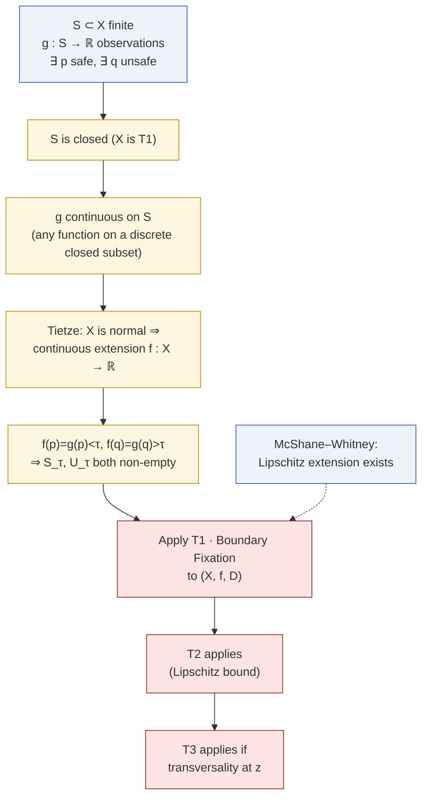
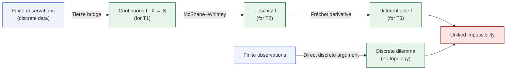

# Continuous Relaxation (Tietze Bridge)

Paper Theorem 8.1 · Lean module `MoF_ContinuousRelaxation`

"You assumed a continuous alignment surface. Real LLMs are discrete.
Does your theorem really apply?" Yes — and the bridge is the Tietze
extension theorem.

## The bridge

::: theorem
**Continuous relaxation.** Let $(X,d)$ be a connected, normal,
Hausdorff metric space, and $S\subset X$ a finite set of observations
with alignment scores $g\colon S\to\mathbb{R}$ satisfying
$g(p)<\tau$ and $g(q)>\tau$ for some $p,q\in S$. Then there exists a
continuous $f\colon X\to\mathbb{R}$ with $f|_S = g$ for which the
hypotheses of [T1](/theorems/boundary-fixation) hold.

If the extension is chosen Lipschitz (via McShane–Whitney), the
hypotheses of [T2](/theorems/eps-robust) hold as well. If in addition
the surface has a directional derivative $>\ell(K+1)$ at the fixed
boundary point, [T3](/theorems/persistent) also applies.
:::

## Why the extension exists



## What this means operationally

The bridge is the answer to "the impossibility is just an artifact of
assuming continuous models":

- If you observe **at least one safe** and **at least one unsafe**
  prompt, then _every_ continuous model consistent with your
  observations has a boundary fixation point.
- In other words, the impossibility is a property of the **data**, not
  of any particular smoothing / interpolation choice.
- If the interpolation scheme you actually use (kernel ridge regression,
  a GP posterior mean, a neural function approximator) is Lipschitz,
  tier T2 bites as well.
- If the scheme is once-differentiable at the boundary point and has a
  steep enough gradient, tier T3 bites.

## Two directions of the bridge



The left column promotes discrete data to continuous models via
topology; the right column stays discrete and uses
[the discrete dilemma](/theorems/discrete). The bridge theorem
guarantees that both columns lead to the same impossibility.

## Why it does not escape by picking a "nice" extension

The Tietze extension is not unique: infinitely many continuous
functions agree with $g$ on $S$. The theorem says **every** such
extension carries the impossibility, because the impossibility follows
from the existence of any safe and any unsafe point. The user of the
theorem therefore does not need to commit to a specific interpolation
scheme.

## In Lean

The `MoF_ContinuousRelaxation` file builds the extension using
Mathlib's `ContinuousOnClosedExtension` and wires it into the
`MoF_08_DefenseBarriers.defense_incompleteness` result.

```lean
-- Main bridge theorem
theorem discrete_to_continuous_impossibility
    {X : Type*} [MetricSpace X] [ConnectedSpace X] [T2Space X]
    [NormalSpace X]
    (S : Finset X) (g : S → ℝ) (τ : ℝ)
    (hp : ∃ p ∈ S, g p < τ)
    (hq : ∃ q ∈ S, g q > τ) :
    ∃ f : X → ℝ, Continuous f ∧ (∀ p ∈ S, f p = g p)
    ∧ (∀ D : X → X, Continuous D →
         (∀ x, f x < τ → D x = x) →
         ∃ z, f z = τ ∧ D z = z)
```

## Next

- [Discrete dilemma](/theorems/discrete) — the counter-part argument
  that skips the bridge entirely.
- [Meta-theorem](/theorems/meta-theorem) — the abstract statement that
  subsumes both.
