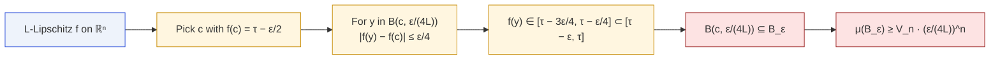
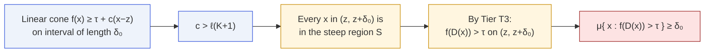

# Quantitative Volume Bounds

Paper Theorems 7.1–7.2 · Lean modules `MoF_17_CoareaBound`,
`MoF_18_ConeBound`

Tiers T2 and T3 both conclude "positive measure". The volume bounds
make that **explicit** — concrete lower bounds on how much unsafe
region survives the defense.

## The coarea bound for the ε-band

::: theorem
**Coarea volume bound.** Let $f\colon\mathbb{R}^n\to\mathbb{R}$ be
$L$-Lipschitz with $L>0$, and let $\mu$ denote Lebesgue measure. If
there exists $c$ with $f(c)=\tau-\varepsilon/2$, then

$$
B\!\left(c,\,\frac{\varepsilon}{4L}\right) \;\subseteq\;
\mathcal B_\varepsilon,
\qquad
\mu(\mathcal B_\varepsilon) \;\ge\; V_n\left(\frac{\varepsilon}{4L}\right)^n
$$

where $V_n$ is the volume of the unit ball in $\mathbb{R}^n$.
In $\mathbb{R}^1$ this simplifies to
$\mu(\mathcal B_\varepsilon)\ge \varepsilon/(2L)$.
:::



### What the bound tells you

- **Smoother surfaces → wider $\varepsilon$-bands.** Halving $L$ halves
  the allowed gradient of $f$, so the $\varepsilon$-band at least
  doubles its extent in each direction. In dimension $n$ the band
  volume scales as $L^{-n}$.
- **Sharper thresholds → tighter bands.** The band shrinks polynomially
  in $\varepsilon$ but remains positive as long as $\varepsilon > 0$.

## The cone bound for the persistent region

::: theorem
**Cone measure bound.** On $\mathbb{R}$ with Lebesgue measure, if

$$
f(x) \;\ge\; \tau + c(x - z)
\qquad\text{for all } x\in(z,z+\delta_0)
$$

with $c>\ell(K+1)$, then

$$
\mu\bigl(\{x : f(D(x))>\tau\}\bigr) \;\ge\; \delta_0.
$$
:::



The bound is **tight**: equality $= \delta_0$ holds precisely when the
cone condition fails at $z+\delta_0$. If the cone extends further, the
persistent region is strictly larger.

## Two bounds side by side

| | Coarea bound (band) | Cone bound (persistent) |
|---|---|---|
| Object | $\mathcal B_\varepsilon$ | $\{x : f(D(x))>\tau\}$ |
| Dimension | any $n$ | $\mathbb{R}^1$ (extends to $\mathbb{R}^n$) |
| Lower bound | $V_n(\varepsilon/(4L))^n$ | $\delta_0$ |
| Input you need | a point $c$ with $f(c)=\tau-\varepsilon/2$ | the cone interval length $\delta_0$ |
| Shrinks as… | $L$ grows | $\ell(K+1)$ approaches the cone slope |

## Why the coarea name?

The bound is actually elementary — just Lipschitz control of $f$ inside
a ball. The name "coarea" is inherited from the paper's appendix,
which frames the same calculation as a crude coarea-formula bound:

$$
\mu(\mathcal B_\varepsilon) \;=\;
\int_{\tau-\varepsilon}^{\tau}
\mathcal{H}^{n-1}(f^{-1}(t))\,\frac{dt}{\|\nabla f\|}
\;\ge\;
\frac{\mathcal{H}^{n-1}(f^{-1}(\tau-\varepsilon/2))\cdot \varepsilon}{L}.
$$

The Lean proof uses the concrete ball inclusion to avoid
formalizing the full coarea formula.

## In Lean

```lean
-- MoF_17_CoareaBound
theorem epsilon_band_contains_ball
    {f : ℝ → ℝ} {L : ℝ} (hL : 0 < L) (hf : LipschitzWith L f) …
theorem epsilon_band_measure_lower_bound : …

-- MoF_18_ConeBound
theorem cone_implies_persistent
    {f : ℝ → ℝ} (z δ₀ c : ℝ) (hc : c > ℓ*(K+1))
    (h_cone : ∀ x ∈ Ioo z (z + δ₀), f x ≥ τ + c*(x - z)) :
    MeasureTheory.volume { x | f (D x) > τ } ≥ δ₀
```

Both are stated against Lebesgue measure on $\mathbb{R}^1$; the
higher-dimensional coarea bound is a ball volume computation and is
handled in `MoF_Cost_01_BallVolume`.

## Next

- [Persistent Unsafe Region](/theorems/persistent) — where the cone
  bound applies.
- [ε-Robust Constraint](/theorems/eps-robust) — where the coarea bound
  applies.
- [Engineering Prescription](/engineering) — how the designer should
  read these bounds.
