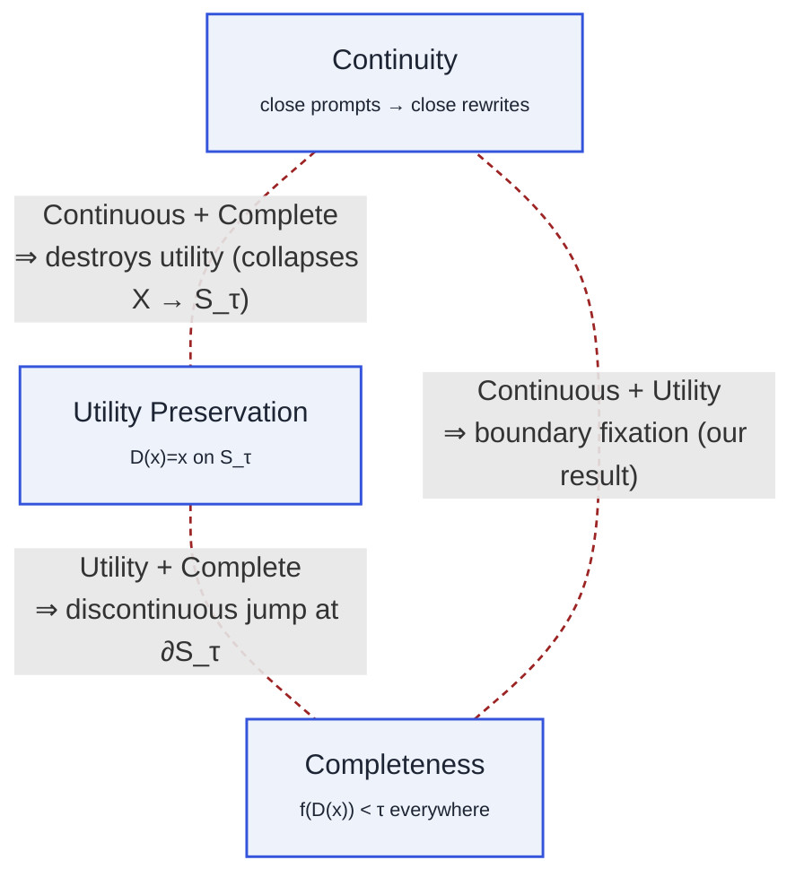
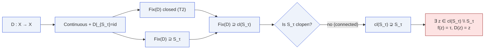

# The Defense Trilemma

> **Continuity**, **utility preservation**, **completeness** — pick at most two.

## The statement

::: theorem
Let $X$ be a connected Hausdorff space, $f\colon X\to\mathbb{R}$ continuous
with $S_\tau,U_\tau\ne\emptyset$. No map $D\colon X\to X$ can simultaneously be

1. **continuous** — close prompts produce close rewrites,
2. **utility-preserving** — $D(x)=x$ for every $x\in S_\tau$, and
3. **complete** — $f(D(x))<\tau$ for every $x\in X$.
:::

Any two can coexist — but all three simultaneously is impossible.

## The triangle

Each dashed edge corresponds to the failure mode that arises if you insist
on the two endpoints of that edge.

## What each failure mode looks like

| Drop                     | Keep                      | Failure mode you get                                           |
|--------------------------|---------------------------|----------------------------------------------------------------|
| ~~Continuity~~           | Utility + Completeness    | A **discontinuous** filter: a hard rejecter at the boundary, equivalent to a blocklist — not a continuous wrapper. |
| ~~Utility preservation~~ | Continuity + Completeness | A **constant** (or generally lossy) map $D(x)=x_0$: every prompt produces the same reply. Utility is destroyed. |
| ~~Completeness~~         | Continuity + Utility      | **Our result:** some boundary points $z$ with $f(z)=\tau$ pass through unchanged. |

## Why the third edge is forced

A continuous utility-preserving complete $D$ would be a **retraction**
$X \twoheadrightarrow S_\tau$ (because $D|_{S_\tau}=\mathrm{id}$ and
$D(X)\subseteq S_\tau$). Continuous retracts of Hausdorff spaces are closed.
But $S_\tau = f^{-1}((-\infty,\tau))$ is **open**, and in a connected space
a non-empty proper subset cannot be clopen. Contradiction.

::: remark
The theorem is tight: removing any single hypothesis gives a counter-example.
See [Limitations & counter-examples](/limitations).
:::

## Where it is in the artifact

| Component | Lean file |
|---|---|
| Continuous-case boundary fixation | `MoF_08_DefenseBarriers` · `defense_incompleteness` |
| Discrete-case dilemma | `MoF_12_Discrete` · `discrete_defense_boundary_fixed` |
| Unified meta-theorem | `MoF_14_MetaTheorem` · `regularity_implies_spillover` |

## Next

- [T1 · Boundary Fixation](/theorems/boundary-fixation) — the pointwise version
- [T2 · ε-Robust Constraint](/theorems/eps-robust) — the neighborhood version
- [T3 · Persistent Unsafe Region](/theorems/persistent) — the measure version
- [Meta-theorem](/theorems/meta-theorem) — why all three paths collapse to one
