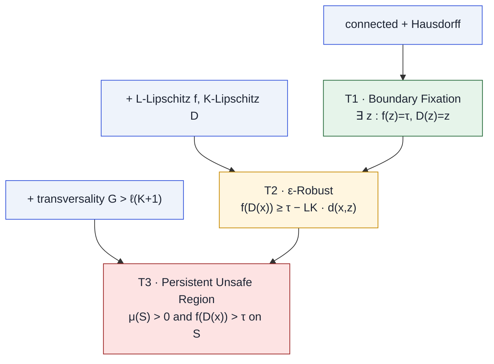
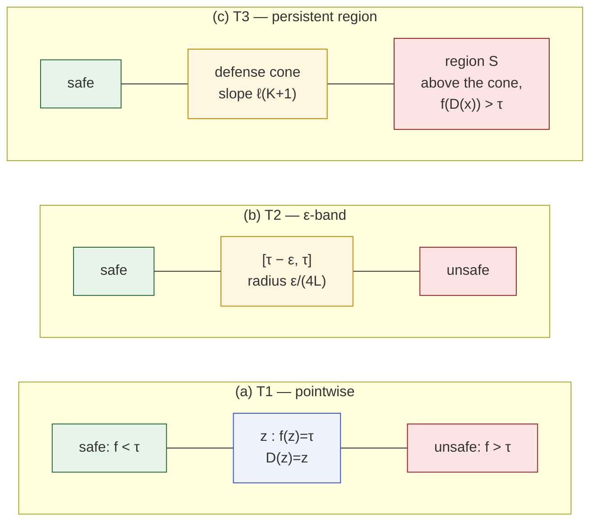
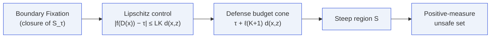

# Three-Tier Escalation

Each tier adds one hypothesis and one stronger conclusion. The
picture below is the single diagram to remember for the whole paper.

## The tiers side-by-side

## What the three tiers look like on a 1D cross-section

## The tier-by-tier comparison

| Tier | Assumption added | Strength of conclusion | Lean file |
|---|---|---|---|
| [T1](/theorems/boundary-fixation) | — | one boundary fixed point | `MoF_08` |
| [T2](/theorems/eps-robust) | Lipschitz $(L,K)$ | neighborhood of slack | `MoF_11` |
| [T3](/theorems/persistent) | transversality $G>\ell(K+1)$ | positive-measure unsafe region | `MoF_11` |

## Tier escalation as a dependency graph

This is the actual logical order the Lean proofs follow, inside
`MoF_11_EpsilonRobust`:

1. From [T1](/theorems/boundary-fixation): $D(z)=z$ and $f(z)=\tau$.
2. From the triangle inequality: $d(D(x),z)\le K\,d(x,z)$.
3. Apply $L$-Lipschitz of $f$: $|f(D(x))-\tau|\le LK\,d(x,z)$.
4. Bound $f$'s growth along the defense's motion by $\ell$.
5. Define the steep region as the set where $f$ exceeds the budget
   cone; show it is open and, under transversality, non-empty.

## Next

- [Boundary Fixation](/theorems/boundary-fixation) for T1.
- [ε-Robust Constraint](/theorems/eps-robust) for T2.
- [Persistent Unsafe Region](/theorems/persistent) for T3.
