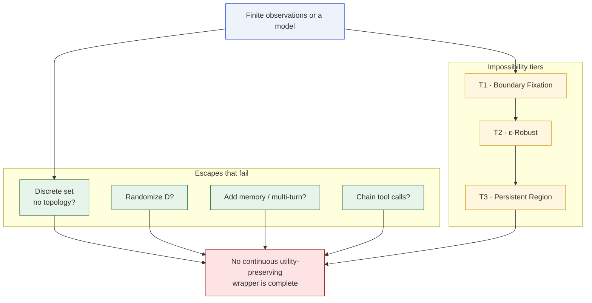

# Visualization Gallery

A single-page index of every mermaid diagram and theorem illustration
used across the site, in one place, for reference.

## Contents

- [Three-tier escalation](/visualizations/escalation) — the main picture
  of T1 → T2 → T3.
- [Trilemma diagram](/visualizations/trilemma) — the three-property
  triangle.
- [Pipeline amplification](/visualizations/pipeline) — how Lipschitz
  constants multiply through an agent tool-chain.
- [Steep region and cone bound](/visualizations/steep-region) — the
  geometric picture behind T3.

## A meta-view of the whole story

## About these diagrams

All diagrams are rendered with [Mermaid](https://mermaid.js.org/) via
[vitepress-plugin-mermaid](https://github.com/emersonbottero/vitepress-plugin-mermaid).
They are regenerated on each build, so any edit to a `.md` file
propagates immediately — there is no separate asset step.
