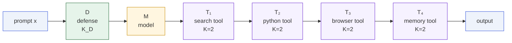
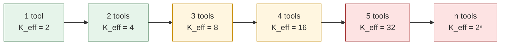
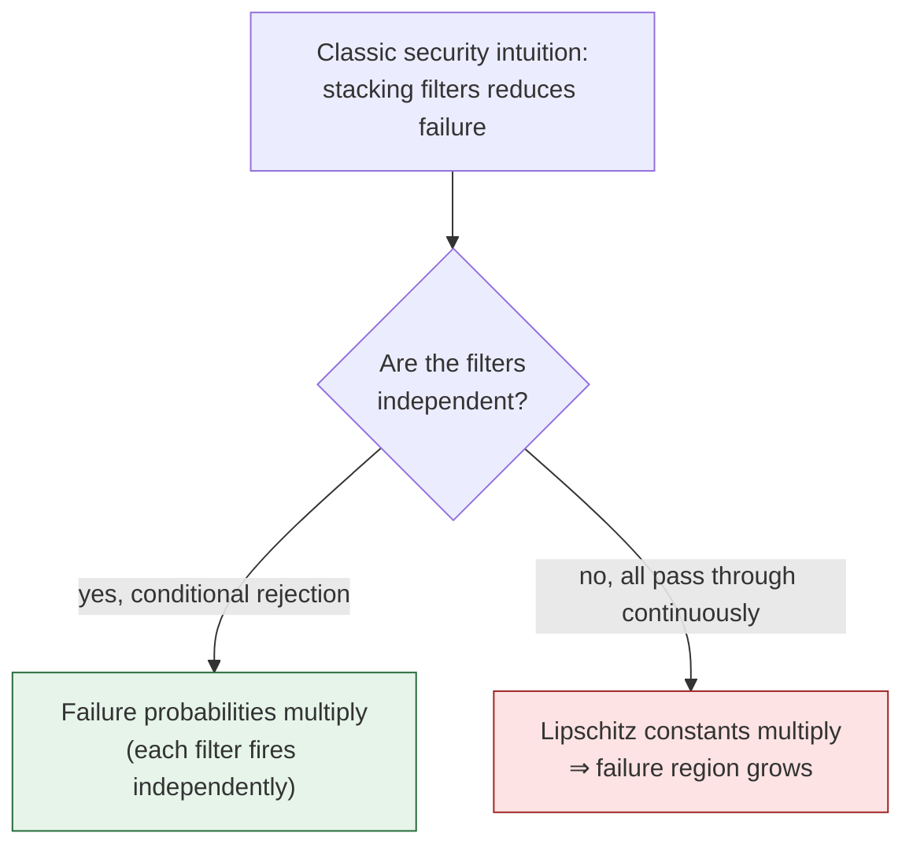
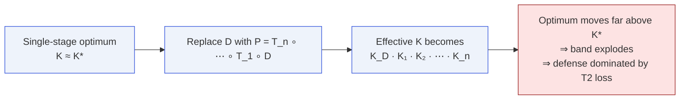

# Pipeline Amplification

How Lipschitz constants multiply through an agent tool-chain, and why
this makes deeper pipelines worse to defend.

See [Pipeline Degradation](/theorems/pipeline) for the formal
statement.

## A five-stage pipeline

Effective Lipschitz constant:

$$
K_\mathrm{eff} \;=\; K_D \cdot 1 \cdot 2 \cdot 2 \cdot 2 \cdot 2
\;=\; 16\,K_D
$$

and the ε-robust band width grows in proportion.

## Band width vs. depth

The band width scales linearly in $K_\mathrm{eff}$, so it grows
**exponentially in the number of tools**. A single-stage defense with
a 1-unit band becomes a 32-unit band at depth 5 and a ~1024-unit
band at depth 10.

## Why naive "defense in depth" fails

The difference between "good" defense in depth and "bad" defense in
depth is whether the stages compose by **rejection** (discontinuous)
or by **continuous pass-through**. The impossibility theorems only
cover the latter.

## How the pipeline breaks the dilemma optimum

Recall the [defense dilemma](/theorems/defense-dilemma): a
single-stage defense must pick $K$ near $K^\star=G/\ell-1$ to balance
the band and the persistent region.

Once the pipeline fixes $K_\mathrm{eff}\gg K^\star$, the persistent
unsafe region might become empty, but the $\varepsilon$-robust band
becomes so wide that the defense can no longer push any point far
below $\tau$. The problem just shifts from "unsafe" to "barely safe".

## Related

- [Pipeline Degradation theorem](/theorems/pipeline)
- [Defense dilemma](/theorems/defense-dilemma)
- Lean file: `MoF_15_NonlinearAgents`.
