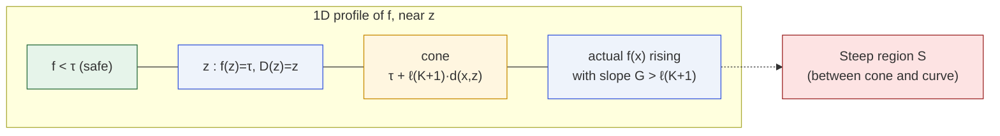
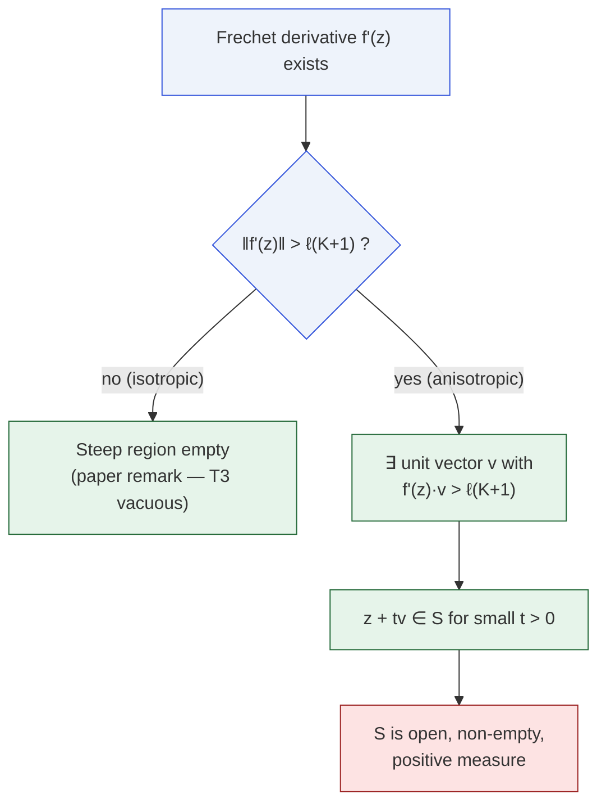
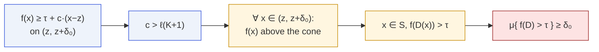
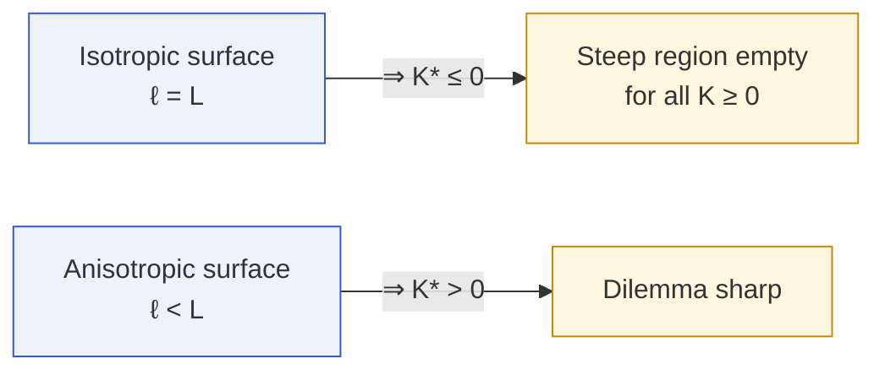

# Steep Region and Cone Bound

The geometric picture behind [Tier T3 — Persistent Unsafe
Region](/theorems/persistent). The steep region is where the
alignment surface outruns the defense's Lipschitz budget.

## The defense budget cone

Fix the boundary point $z$ and draw a cone of slope $\ell(K+1)$
rooted at $(z,\tau)$.

- The cone marks the **maximum** reduction the defense can achieve at
  distance $d(x,z)$ from $z$.
- The actual alignment surface $f(x)$ rises with directional slope $G$
  at $z$.
- Wherever $G>\ell(K+1)$, the curve punches **through** the cone into
  the steep region — and inside that region the defense cannot bring
  $f(D(x))$ below $\tau$.

## When the steep region is non-empty

This is exactly
`gradient_norm_implies_steep_nonempty` in `MoF_21_GradientChain`.

## The cone bound in action

The cone bound (`MoF_18_ConeBound`) gives an **explicit**
lower bound on the persistent region when $f$ is linear in a
neighborhood of $z$:

The bound is tight: $\ge\delta_0$, with equality when the cone
condition fails exactly at the endpoint.

## Relation to isotropy

In isotropic settings tier T3 is vacuous and the defense only has to
worry about the $\varepsilon$-band. In anisotropic settings —
empirically observed in the two LLMs with non-empty unsafe region in
the paper's experiments — the steep region is where the impossibility
has teeth.

## Related

- [Persistent Unsafe Region](/theorems/persistent) — the full theorem.
- [Defense dilemma (K*)](/theorems/defense-dilemma) — the designer's
  trade-off.
- [Volume bounds](/theorems/volume-bounds) — the coarea and cone
  bounds.
