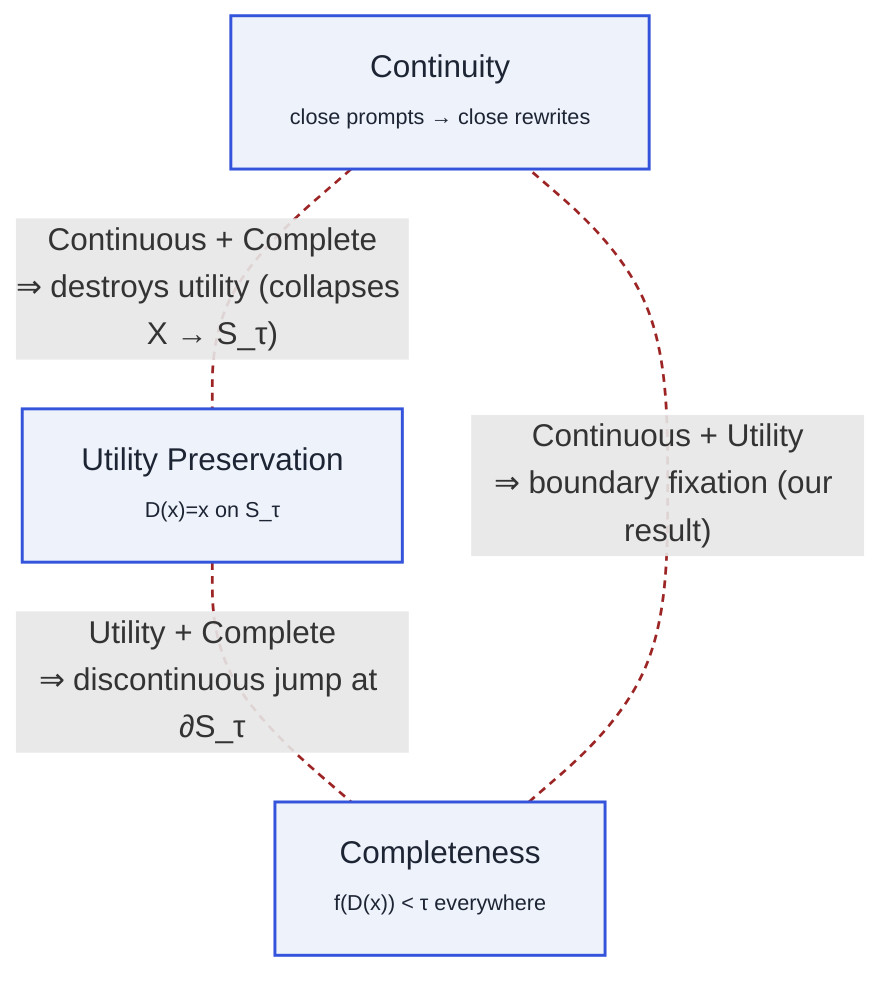
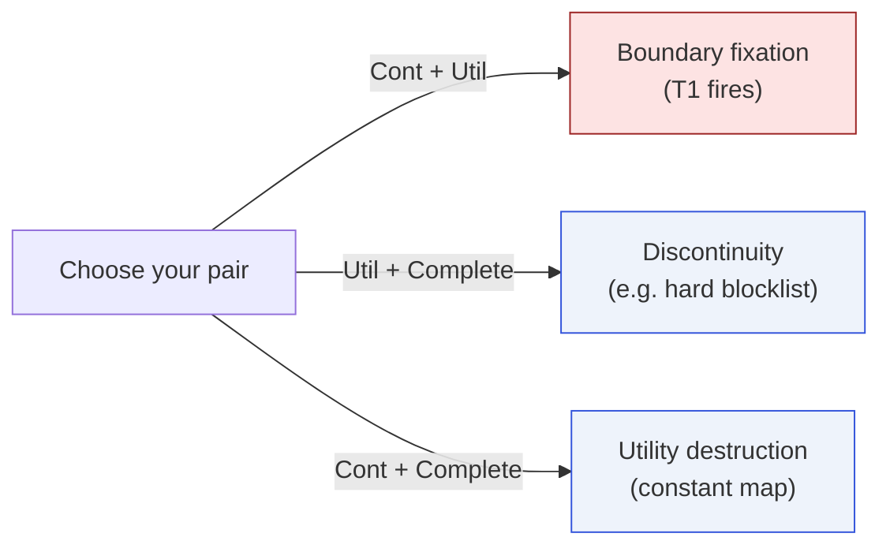
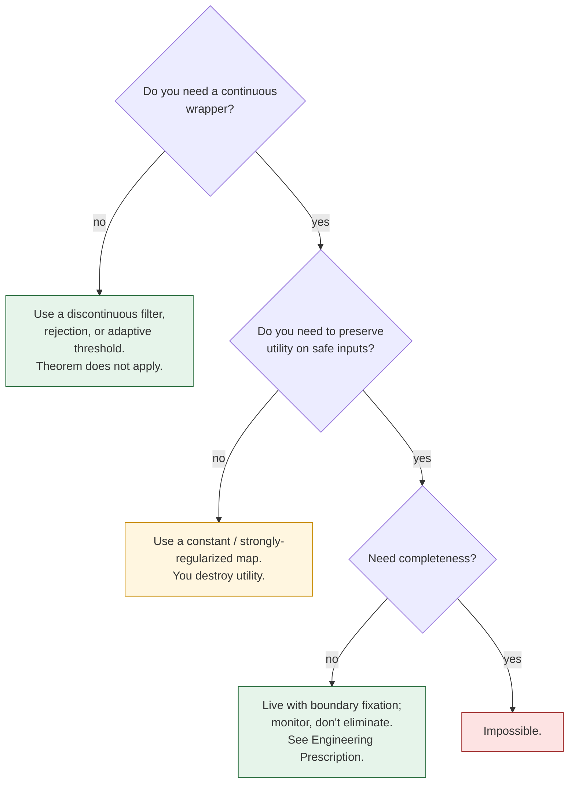

# Trilemma Diagram

See [The Defense Trilemma](/trilemma) for the full discussion — this
page is the visualization-only companion.

## The triangle

## The failure modes

## As a decision flow for designers

## Corresponding Lean content

- `MoF_08_DefenseBarriers.defense_incompleteness` — formal statement
  of the third edge of the trilemma.
- `MoF_16_RelaxedUtility` — weakened utility-preservation variants.
- `MoF_14_MetaTheorem` — abstract form with "regularity" replacing
  "continuity".
